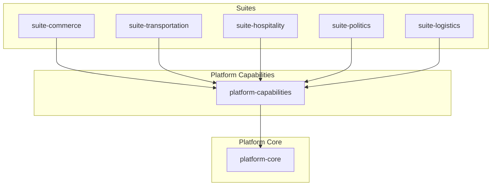

# EXECUTION MIGRATION BLUEPRINT V2

**Agent Identity:** webwaka007
**Authority Level:** Founder Agent
**Priority:** CRITICAL
**Date:** 2026-02-15

---

## 1. OBJECTIVE

This document provides the **authoritative, corrected, and final** anatomical map of the WebWaka platform. It supersedes Blueprint V1 and provides the mechanical, deterministic plan to migrate the current monolithic reality into the target architecture defined by the WebWaka constitution.

**The core principle is non-negotiable: Suites orchestrate. Capabilities live at the platform level. Zero business logic will be trapped in suites.**

This blueprint eliminates the silo risk identified in V1 and establishes a permanent, scalable structure for all future development.

## 2. TARGET ARCHITECTURE MODEL

The WebWaka platform is composed of three primary layers:

1.  **Platform Core:** Foundational, suite-agnostic infrastructure (8 capabilities)
2.  **Platform Capabilities:** Reusable, cross-suite business primitives (30 capabilities)
3.  **Suites:** Thin orchestration layers that compose platform capabilities to serve specific verticals (5 suites defined)

This structure guarantees reuse, prevents duplication, and ensures that all business logic is available to any suite that needs it.

---

## 3. CANONICAL CAPABILITY CLASSIFICATION

This table provides the authoritative classification of every capability within the WebWaka platform, based on its reuse potential and architectural role.

| Capability | Type | Reuse Potential | Final Home | Reasoning |
|---|---|---|---|---|
| `ai-abstraction-layer` | **PLATFORM_CAPABILITY** | UNIVERSAL | `webwaka-platform-capabilities/src/ai` | AI/ML abstraction layer - cross-platform intelligence infrastructure for all suites |
| `ai-extension-framework` | **PLATFORM_CAPABILITY** | UNIVERSAL | `webwaka-platform-capabilities/src/ai-extensions` | AI extensibility framework - part of cross-platform AI infrastructure |
| `analytics-reporting` | **PLATFORM_CAPABILITY** | CROSS_SUITE | `webwaka-platform-capabilities/src/analytics` | Analytics and reporting - needed by every suite for business intelligence |
| `booking-scheduling` | **PLATFORM_CAPABILITY** | CROSS_SUITE | `webwaka-platform-capabilities/src/booking` | Booking/scheduling - reusable in Hospitality, Healthcare, Education, Transportation, Real Estate |
| `communication-tools` | **PLATFORM_CAPABILITY** | CROSS_SUITE | `webwaka-platform-capabilities/src/communication` | Messaging/communication - universal across all suites |
| `community-organizing-module` | **PLATFORM_CAPABILITY** | CROSS_SUITE | `webwaka-platform-capabilities/src/community-organizing` | Community organizing tools - reusable in Politics, Church, Civic, Education |
| `community-platform` | **PLATFORM_CAPABILITY** | CROSS_SUITE | `webwaka-platform-capabilities/src/community` | Community features (forums, groups, feeds) - reusable in Church, Politics, Education, Civic |
| `contract-management` | **PLATFORM_CAPABILITY** | CROSS_SUITE | `webwaka-platform-capabilities/src/contracts` | Contracts - reusable in Real Estate, Recruitment, Transportation, Hospitality |
| `donations` | **PLATFORM_CAPABILITY** | CROSS_SUITE | `webwaka-platform-capabilities/src/fundraising` | Donations/fundraising - reusable in Politics, Church, Community, Education, Civic |
| `economic-engine` | **PLATFORM_CAPABILITY** | CROSS_SUITE | `webwaka-platform-capabilities/src/mlas` | MLAS (Multi-Level Affiliate System) - cross-platform monetization backbone used by all revenue-generating suites |
| `events` | **PLATFORM_CAPABILITY** | CROSS_SUITE | `webwaka-platform-capabilities/src/events-management` | Event management (NOT event-system) - reusable in Church, Community, Politics, Education for managing events/attendance |
| `fleet-management` | **PLATFORM_CAPABILITY** | CROSS_SUITE | `webwaka-platform-capabilities/src/fleet` | Fleet management - reusable in Transportation, Logistics, Ride Hailing, Delivery |
| `fraud-prevention` | **PLATFORM_CAPABILITY** | CROSS_SUITE | `webwaka-platform-capabilities/src/fraud-prevention` | Fraud detection - needed wherever transactions occur |
| `fundraising-module` | **PLATFORM_CAPABILITY** | CROSS_SUITE | `webwaka-platform-capabilities/src/fundraising` | Same as donations - cross-suite fundraising primitive |
| `headless-cms` | **PLATFORM_CAPABILITY** | CROSS_SUITE | `webwaka-platform-capabilities/src/cms` | Content management - reusable in Sites & Funnels, Community, Church, Education |
| `inventory-sync` | **PLATFORM_CAPABILITY** | CROSS_SUITE | `webwaka-platform-capabilities/src/inventory` | Inventory management - reusable in Commerce, Hospitality, Logistics, Healthcare |
| `member-management` | **PLATFORM_CAPABILITY** | CROSS_SUITE | `webwaka-platform-capabilities/src/membership` | Membership management - reusable in Church, Community, Politics, Education, Healthcare |
| `mvm` | **PLATFORM_CAPABILITY** | CROSS_SUITE | `webwaka-platform-capabilities/src/mvm` | Multi-Vendor Marketplace - reusable in Commerce, Real Estate, Recruitment, Education |
| `no-code-builder` | **PLATFORM_CAPABILITY** | CROSS_SUITE | `webwaka-platform-capabilities/src/no-code` | No-code tools - enable customization across all suites |
| `payment-billing` | **PLATFORM_CAPABILITY** | CROSS_SUITE | `webwaka-platform-capabilities/src/payment` | Payments - reusable in Commerce, Hospitality, Transportation, Politics, Church, Education |
| `pos` | **PLATFORM_CAPABILITY** | CROSS_SUITE | `webwaka-platform-capabilities/src/pos` | Point-of-Sale - reusable in Commerce, Hospitality, Church, Education, Healthcare |
| `sales` | **PLATFORM_CAPABILITY** | CROSS_SUITE | `webwaka-platform-capabilities/src/sales` | Sales pipeline/CRM - reusable in Commerce, Real Estate, Recruitment, B2B |
| `search-discovery` | **PLATFORM_CAPABILITY** | CROSS_SUITE | `webwaka-platform-capabilities/src/search` | Search - universal capability needed across all suites |
| `sites-funnels-email-campaign-builder` | **PLATFORM_CAPABILITY** | CROSS_SUITE | `webwaka-platform-capabilities/src/email-builder` | Email campaign builder - reusable across all suites for marketing |
| `sites-funnels-form-builder` | **PLATFORM_CAPABILITY** | CROSS_SUITE | `webwaka-platform-capabilities/src/form-builder` | Form builder - universally reusable for data collection |
| `sites-funnels-landing-page-builder` | **PLATFORM_CAPABILITY** | CROSS_SUITE | `webwaka-platform-capabilities/src/landing-page-builder` | Landing page builder - reusable for marketing across all suites |
| `sites-funnels-sales-funnel-builder` | **PLATFORM_CAPABILITY** | CROSS_SUITE | `webwaka-platform-capabilities/src/funnel-builder` | Sales funnel builder - reusable for conversion optimization |
| `sites-funnels-website-builder` | **PLATFORM_CAPABILITY** | CROSS_SUITE | `webwaka-platform-capabilities/src/website-builder` | Website builder - universally reusable |
| `svm` | **PLATFORM_CAPABILITY** | CROSS_SUITE | `webwaka-platform-capabilities/src/svm` | Single-Vendor Marketplace - reusable commerce primitive for any suite needing storefront |
| `website-builder` | **PLATFORM_CAPABILITY** | CROSS_SUITE | `webwaka-platform-capabilities/src/website-builder` | Website builder - universally reusable for all suites needing web presence |
| `api-layer` | **PLATFORM_CORE** | UNIVERSAL | `webwaka-platform-core/src/core/api-gateway` | API Gateway, authentication, authorization, rate limiting - universal entry point |
| `audit-system` | **PLATFORM_CORE** | UNIVERSAL | `webwaka-platform-core/src/core/audit` | Audit logging required across all business operations |
| `event-system` | **PLATFORM_CORE** | UNIVERSAL | `webwaka-modules-event-system` | Event-driven architecture primitive - universal infrastructure |
| `module-system` | **PLATFORM_CORE** | UNIVERSAL | `webwaka-modules-module-system` | Module loading and lifecycle management - universal infrastructure |
| `plugin-system` | **PLATFORM_CORE** | UNIVERSAL | `webwaka-modules-plugin-system` | Platform extensibility primitive - universal infrastructure |
| `sync-engine` | **PLATFORM_CORE** | UNIVERSAL | `webwaka-platform-core/src/core/sync` | Offline-first synchronization - universal infrastructure for all suites |
| `user-identity` | **PLATFORM_CORE** | UNIVERSAL | `webwaka-platform-core/src/core/identity` | Identity and authentication - foundational to all suites |
| `weeg` | **PLATFORM_CORE** | UNIVERSAL | `webwaka-platform-core/src/core/permissions` | Role-Capability-Permission system - foundational authorization for all suites |
| `commerce` | **SUITE_ORCHESTRATION** | NONE | `webwaka-suite-commerce/src/orchestration` | Commerce suite orchestrates POS/SVM/MVM capabilities |
| `logistics` | **SUITE_ORCHESTRATION** | NONE | `webwaka-suite-logistics/src/orchestration` | Logistics suite orchestrates fleet, routing, warehouse, delivery |
| `transportation` | **SUITE_ORCHESTRATION** | NONE | `webwaka-suite-transportation/src/orchestration` | Transportation suite orchestrates fleet, routing, booking |
| `campaign-management` | **SUITE_SPECIFIC** | LOW | `webwaka-suite-politics/src/campaign-management` | Political campaign management - politics vertical-specific |
| `constituency-management` | **SUITE_SPECIFIC** | LOW | `webwaka-suite-politics/src/constituency-management` | Electoral constituency management - politics-specific |
| `hospitality-booking-engine` | **SUITE_SPECIFIC** | LOW | `webwaka-suite-hospitality/src/booking-engine` | Hospitality-specific booking with room types, rates, channels - uses generic booking underneath |
| `hospitality-channel-management` | **SUITE_SPECIFIC** | LOW | `webwaka-suite-hospitality/src/channel-management` | OTA channel management - hospitality industry-specific |
| `hospitality-guest-management` | **SUITE_SPECIFIC** | LOW | `webwaka-suite-hospitality/src/guest-management` | Guest profiles - hospitality-specific, built on generic membership |
| `hospitality-property-management` | **SUITE_SPECIFIC** | LOW | `webwaka-suite-hospitality/src/property-management` | Property/hotel management - hospitality vertical-specific |
| `motor-park` | **SUITE_SPECIFIC** | LOW | `webwaka-suite-transportation/src/motor-park` | Motor park terminal management - Nigerian transportation context-specific |
| `political-analytics-module` | **SUITE_SPECIFIC** | LOW | `webwaka-suite-politics/src/analytics` | Political analytics (polling, voter sentiment) - politics-specific, uses generic analytics underneath |
| `polling-results` | **SUITE_SPECIFIC** | LOW | `webwaka-suite-politics/src/polling` | Election polling - politics vertical-specific |
| `transport-company` | **SUITE_SPECIFIC** | LOW | `webwaka-suite-transportation/src/transport-company` | Transport company management - transportation vertical-specific |
| `voter-engagement-module` | **SUITE_SPECIFIC** | LOW | `webwaka-suite-politics/src/voter-engagement` | Voter outreach - politics-specific, uses generic communication underneath |

---

## 4. TARGET ARCHITECTURE MODEL (DETAILED)

### 4.1. Platform Core

Foundational, suite-agnostic infrastructure. These are the non-negotiable primitives of the platform.

- **`webwaka-modules-event-system`**: Event-driven architecture primitive - universal infrastructure
- **`webwaka-modules-module-system`**: Module loading and lifecycle management - universal infrastructure
- **`webwaka-modules-plugin-system`**: Platform extensibility primitive - universal infrastructure
- **`webwaka-platform-core/src/core/identity`**: Identity and authentication - foundational to all suites
- **`webwaka-platform-core/src/core/audit`**: Audit logging required across all business operations
- **`webwaka-platform-core/src/core/api-gateway`**: API Gateway, authentication, authorization, rate limiting - universal entry point
- **`webwaka-platform-core/src/core/sync`**: Offline-first synchronization - universal infrastructure for all suites
- **`webwaka-platform-core/src/core/permissions`**: Role-Capability-Permission system - foundational authorization for all suites

### 4.2. Platform Capabilities

Reusable, cross-suite business primitives. These are the building blocks that suites compose.

#### Mlas
- **`webwaka-platform-capabilities/src/mlas`**: MLAS (Multi-Level Affiliate System) - cross-platform monetization backbone used by all revenue-generating suites (Reuse: CROSS_SUITE)

#### Ai
- **`webwaka-platform-capabilities/src/ai`**: AI/ML abstraction layer - cross-platform intelligence infrastructure for all suites (Reuse: UNIVERSAL)
- **`webwaka-platform-capabilities/src/ai-extensions`**: AI extensibility framework - part of cross-platform AI infrastructure (Reuse: UNIVERSAL)

#### Commerce
- **`webwaka-platform-capabilities/src/pos`**: Point-of-Sale - reusable in Commerce, Hospitality, Church, Education, Healthcare (Reuse: CROSS_SUITE)
- **`webwaka-platform-capabilities/src/svm`**: Single-Vendor Marketplace - reusable commerce primitive for any suite needing storefront (Reuse: CROSS_SUITE)
- **`webwaka-platform-capabilities/src/mvm`**: Multi-Vendor Marketplace - reusable in Commerce, Real Estate, Recruitment, Education (Reuse: CROSS_SUITE)
- **`webwaka-platform-capabilities/src/inventory`**: Inventory management - reusable in Commerce, Hospitality, Logistics, Healthcare (Reuse: CROSS_SUITE)
- **`webwaka-platform-capabilities/src/sales`**: Sales pipeline/CRM - reusable in Commerce, Real Estate, Recruitment, B2B (Reuse: CROSS_SUITE)

#### Payment
- **`webwaka-platform-capabilities/src/payment`**: Payments - reusable in Commerce, Hospitality, Transportation, Politics, Church, Education (Reuse: CROSS_SUITE)

#### Booking
- **`webwaka-platform-capabilities/src/booking`**: Booking/scheduling - reusable in Hospitality, Healthcare, Education, Transportation, Real Estate (Reuse: CROSS_SUITE)

#### Membership
- **`webwaka-platform-capabilities/src/membership`**: Membership management - reusable in Church, Community, Politics, Education, Healthcare (Reuse: CROSS_SUITE)
- **`webwaka-platform-capabilities/src/community`**: Community features (forums, groups, feeds) - reusable in Church, Politics, Education, Civic (Reuse: CROSS_SUITE)
- **`webwaka-platform-capabilities/src/community-organizing`**: Community organizing tools - reusable in Politics, Church, Civic, Education (Reuse: CROSS_SUITE)

#### Fundraising
- **`webwaka-platform-capabilities/src/fundraising`**: Donations/fundraising - reusable in Politics, Church, Community, Education, Civic (Reuse: CROSS_SUITE)
- **`webwaka-platform-capabilities/src/fundraising`**: Same as donations - cross-suite fundraising primitive (Reuse: CROSS_SUITE)

#### Communication
- **`webwaka-platform-capabilities/src/communication`**: Messaging/communication - universal across all suites (Reuse: CROSS_SUITE)

#### Analytics
- **`webwaka-platform-capabilities/src/analytics`**: Analytics and reporting - needed by every suite for business intelligence (Reuse: CROSS_SUITE)

#### Search
- **`webwaka-platform-capabilities/src/search`**: Search - universal capability needed across all suites (Reuse: CROSS_SUITE)

#### Security
- **`webwaka-platform-capabilities/src/fraud-prevention`**: Fraud detection - needed wherever transactions occur (Reuse: CROSS_SUITE)

#### Contracts
- **`webwaka-platform-capabilities/src/contracts`**: Contracts - reusable in Real Estate, Recruitment, Transportation, Hospitality (Reuse: CROSS_SUITE)

#### Content
- **`webwaka-platform-capabilities/src/cms`**: Content management - reusable in Sites & Funnels, Community, Church, Education (Reuse: CROSS_SUITE)

#### Builders
- **`webwaka-platform-capabilities/src/no-code`**: No-code tools - enable customization across all suites (Reuse: CROSS_SUITE)
- **`webwaka-platform-capabilities/src/website-builder`**: Website builder - universally reusable for all suites needing web presence (Reuse: CROSS_SUITE)
- **`webwaka-platform-capabilities/src/email-builder`**: Email campaign builder - reusable across all suites for marketing (Reuse: CROSS_SUITE)
- **`webwaka-platform-capabilities/src/form-builder`**: Form builder - universally reusable for data collection (Reuse: CROSS_SUITE)
- **`webwaka-platform-capabilities/src/landing-page-builder`**: Landing page builder - reusable for marketing across all suites (Reuse: CROSS_SUITE)
- **`webwaka-platform-capabilities/src/funnel-builder`**: Sales funnel builder - reusable for conversion optimization (Reuse: CROSS_SUITE)
- **`webwaka-platform-capabilities/src/website-builder`**: Website builder - universally reusable (Reuse: CROSS_SUITE)

#### Fleet
- **`webwaka-platform-capabilities/src/fleet`**: Fleet management - reusable in Transportation, Logistics, Ride Hailing, Delivery (Reuse: CROSS_SUITE)

#### Events
- **`webwaka-platform-capabilities/src/events-management`**: Event management (NOT event-system) - reusable in Church, Community, Politics, Education for managing events/attendance (Reuse: CROSS_SUITE)

### 4.3. Suites

Thin orchestration layers that compose platform capabilities to serve specific verticals. **Suites contain no business logic.**

- **`webwaka-suite-commerce`**
- **`webwaka-suite-transportation`**
- **`webwaka-suite-logistics`**
- **`webwaka-suite-hospitality`**
- **`webwaka-suite-politics`**

---

## 5. MLAS STATUS CORRECTION

The Multi-Level Affiliate System (MLAS), previously misidentified as `economic-engine`, is hereby elevated to its correct status as a cross-platform, monetization backbone capability.

| Item | Description |
|---|---|
| **Canonical Name** | Economic & Affiliate Graph (MLAS) |
| **Where it lives** | `webwaka-platform-capabilities/src/mlas` |
| **Who consumes it** | Any suite requiring revenue sharing, commissions, or affiliate models (e.g., Commerce, Hospitality, Transportation, Politics) |
| **Versioning Model** | Semantic versioning (SemVer). The MLAS capability will be versioned as a standalone package. |
| **Extension Pattern** | The MLAS capability will expose a plugin system for custom commission models and payout providers. |

---

## 6. DEPENDENCY GRAPH

This graph proves the clean architectural layering. **Suites depend on Capabilities, which depend on Core. There are no reverse dependencies.**

This visualizes the one-way dependency flow, proving no hidden coupling or reverse ownership.

---

## 7. ANTI-SILO PROOF

This section demonstrates how the new architecture allows for the creation of future suites without copying logic, proving the elimination of silos.

### Hypothetical Future Suite: **`webwaka-suite-healthcare`**

| Required Functionality | Platform Capability Used | Status |
|---|---|---|
| Patient Appointments | `platform-capabilities/src/booking` | ✅ Plugs in |
| Patient Billing | `platform-capabilities/src/payment` | ✅ Plugs in |
| Patient Records | `platform-capabilities/src/membership` | ✅ Plugs in |
| Pharmacy POS | `platform-capabilities/src/pos` | ✅ Plugs in |
| Medical Supply Inventory | `platform-capabilities/src/inventory` | ✅ Plugs in |

### Hypothetical Future Suite: **`webwaka-suite-education`**

| Required Functionality | Platform Capability Used | Status |
|---|---|---|
| Class Scheduling | `platform-capabilities/src/booking` | ✅ Plugs in |
| Tuition Payment | `platform-capabilities/src/payment` | ✅ Plugs in |
| Student Enrollment | `platform-capabilities/src/membership` | ✅ Plugs in |
| Course Marketplace | `platform-capabilities/src/mvm` | ✅ Plugs in |
| Campus Bookstore | `platform-capabilities/src/svm` | ✅ Plugs in |

### Hypothetical Future Suite: **`webwaka-suite-real-estate`**

| Required Functionality | Platform Capability Used | Status |
|---|---|---|
| Property Viewings | `platform-capabilities/src/booking` | ✅ Plugs in |
| Agent Commissions | `platform-capabilities/src/mlas` | ✅ Plugs in |
| Property Listings | `platform-capabilities/src/svm` | ✅ Plugs in |
| Agent Marketplace | `platform-capabilities/src/mvm` | ✅ Plugs in |
| Contract Management | `platform-capabilities/src/contracts` | ✅ Plugs in |

---

## 8. MIGRATION RE-TARGET TABLE

This table provides the corrected, final destinations for all capabilities being migrated from the monolith.

| Capability | V1 (Illegal) Target | V2 (Correct) Target | Action |
|---|---|---|---|
| `ai-abstraction-layer` | `//webwaka-platform-core/src/ai-abstraction-layer` | **`/webwaka-platform-capabilities/src/ai`** | EXTRACT_TO_CAPABILITIES |
| `ai-extension-framework` | `//webwaka-platform-core/src/ai-extension-framework` | **`/webwaka-platform-capabilities/src/ai-extensions`** | EXTRACT_TO_CAPABILITIES |
| `analytics-reporting` | `//webwaka-platform-core/src/analytics-reporting` | **`/webwaka-platform-capabilities/src/analytics`** | EXTRACT_TO_CAPABILITIES |
| `booking-scheduling` | `//webwaka-platform-core/src/booking-scheduling` | **`/webwaka-platform-capabilities/src/booking`** | EXTRACT_TO_CAPABILITIES |
| `communication-tools` | `//webwaka-platform-core/src/communication-tools` | **`/webwaka-platform-capabilities/src/communication`** | EXTRACT_TO_CAPABILITIES |
| `community-organizing-module` | `//webwaka-platform-core/src/community-organizing-module` | **`/webwaka-platform-capabilities/src/community-organizing`** | EXTRACT_TO_CAPABILITIES |
| `community-platform` | `//webwaka-platform-core/src/community-platform` | **`/webwaka-platform-capabilities/src/community`** | EXTRACT_TO_CAPABILITIES |
| `contract-management` | `//webwaka-platform-core/src/contract-management` | **`/webwaka-platform-capabilities/src/contracts`** | EXTRACT_TO_CAPABILITIES |
| `donations` | `//webwaka-platform-core/src/donations` | **`/webwaka-platform-capabilities/src/fundraising`** | EXTRACT_TO_CAPABILITIES |
| `economic-engine` | `//webwaka-platform-core/src/economic-engine` | **`/webwaka-platform-capabilities/src/mlas`** | EXTRACT_TO_CAPABILITIES |
| `events` | `//webwaka-platform-core/src/events` | **`/webwaka-platform-capabilities/src/events-management`** | EXTRACT_TO_CAPABILITIES |
| `fleet-management` | `//webwaka-platform-core/src/fleet-management` | **`/webwaka-platform-capabilities/src/fleet`** | EXTRACT_TO_CAPABILITIES |
| `fraud-prevention` | `//webwaka-platform-core/src/fraud-prevention` | **`/webwaka-platform-capabilities/src/fraud-prevention`** | EXTRACT_TO_CAPABILITIES |
| `fundraising-module` | `//webwaka-platform-core/src/fundraising-module` | **`/webwaka-platform-capabilities/src/fundraising`** | EXTRACT_TO_CAPABILITIES |
| `headless-cms` | `//webwaka-platform-core/src/headless-cms` | **`/webwaka-platform-capabilities/src/cms`** | EXTRACT_TO_CAPABILITIES |
| `inventory-sync` | `//webwaka-platform-core/src/inventory-sync` | **`/webwaka-platform-capabilities/src/inventory`** | EXTRACT_TO_CAPABILITIES |
| `member-management` | `//webwaka-platform-core/src/member-management` | **`/webwaka-platform-capabilities/src/membership`** | EXTRACT_TO_CAPABILITIES |
| `mvm` | `//webwaka-platform-core/src/mvm` | **`/webwaka-platform-capabilities/src/mvm`** | EXTRACT_TO_CAPABILITIES |
| `no-code-builder` | `//webwaka-platform-core/src/no-code-builder` | **`/webwaka-platform-capabilities/src/no-code`** | EXTRACT_TO_CAPABILITIES |
| `payment-billing` | `//webwaka-platform-core/src/payment-billing` | **`/webwaka-platform-capabilities/src/payment`** | EXTRACT_TO_CAPABILITIES |
| `pos` | `//webwaka-platform-core/src/pos` | **`/webwaka-platform-capabilities/src/pos`** | EXTRACT_TO_CAPABILITIES |
| `sales` | `//webwaka-platform-core/src/sales` | **`/webwaka-platform-capabilities/src/sales`** | EXTRACT_TO_CAPABILITIES |
| `search-discovery` | `//webwaka-platform-core/src/search-discovery` | **`/webwaka-platform-capabilities/src/search`** | EXTRACT_TO_CAPABILITIES |
| `sites-funnels-email-campaign-builder` | `//webwaka-platform-core/src/sites-funnels-email-campaign-builder` | **`/webwaka-platform-capabilities/src/email-builder`** | EXTRACT_TO_CAPABILITIES |
| `sites-funnels-form-builder` | `//webwaka-platform-core/src/sites-funnels-form-builder` | **`/webwaka-platform-capabilities/src/form-builder`** | EXTRACT_TO_CAPABILITIES |
| `sites-funnels-landing-page-builder` | `//webwaka-platform-core/src/sites-funnels-landing-page-builder` | **`/webwaka-platform-capabilities/src/landing-page-builder`** | EXTRACT_TO_CAPABILITIES |
| `sites-funnels-sales-funnel-builder` | `//webwaka-platform-core/src/sites-funnels-sales-funnel-builder` | **`/webwaka-platform-capabilities/src/funnel-builder`** | EXTRACT_TO_CAPABILITIES |
| `sites-funnels-website-builder` | `//webwaka-platform-core/src/sites-funnels-website-builder` | **`/webwaka-platform-capabilities/src/website-builder`** | EXTRACT_TO_CAPABILITIES |
| `svm` | `//webwaka-platform-core/src/svm` | **`/webwaka-platform-capabilities/src/svm`** | EXTRACT_TO_CAPABILITIES |
| `website-builder` | `//webwaka-platform-core/src/website-builder` | **`/webwaka-platform-capabilities/src/website-builder`** | EXTRACT_TO_CAPABILITIES |
| `api-layer` | `//webwaka-platform-core/src/api-layer` | **`/webwaka-platform-core/src/core/api-gateway`** | EXTRACT_TO_CORE |
| `audit-system` | `//webwaka-platform-core/src/audit-system` | **`/webwaka-platform-core/src/core/audit`** | EXTRACT_TO_CORE |
| `event-system` | `//webwaka-platform-core/src/event-system` | **`/webwaka-modules-event-system`** | DELETE_FROM_MONOLITH |
| `module-system` | `//webwaka-platform-core/src/module-system` | **`/webwaka-modules-module-system`** | DELETE_FROM_MONOLITH |
| `plugin-system` | `//webwaka-platform-core/src/plugin-system` | **`/webwaka-modules-plugin-system`** | DELETE_FROM_MONOLITH |
| `sync-engine` | `//webwaka-platform-core/src/sync-engine` | **`/webwaka-platform-core/src/core/sync`** | EXTRACT_TO_CORE |
| `user-identity` | `//webwaka-platform-core/src/user-identity` | **`/webwaka-platform-core/src/core/identity`** | EXTRACT_TO_CORE |
| `weeg` | `//webwaka-platform-core/src/weeg` | **`/webwaka-platform-core/src/core/permissions`** | EXTRACT_TO_CORE |
| `commerce` | `//webwaka-suite-commerce/commerce` | **`/webwaka-suite-commerce/src/orchestration`** | EXTRACT_TO_SUITE |
| `logistics` | `//webwaka-suite-logistics/logistics` | **`/webwaka-suite-logistics/src/orchestration`** | EXTRACT_TO_SUITE |
| `transportation` | `//webwaka-suite-transportation/transportation` | **`/webwaka-suite-transportation/src/orchestration`** | EXTRACT_TO_SUITE |
| `campaign-management` | `//webwaka-suite-campaign/campaign-management` | **`/webwaka-suite-politics/src/campaign-management`** | EXTRACT_TO_SUITE |
| `constituency-management` | `//webwaka-suite-constituency/constituency-management` | **`/webwaka-suite-politics/src/constituency-management`** | EXTRACT_TO_SUITE |
| `hospitality-booking-engine` | `//webwaka-suite-hospitality/hospitality-booking-engine` | **`/webwaka-suite-hospitality/src/booking-engine`** | EXTRACT_TO_SUITE |
| `hospitality-channel-management` | `//webwaka-suite-hospitality/hospitality-channel-management` | **`/webwaka-suite-hospitality/src/channel-management`** | EXTRACT_TO_SUITE |
| `hospitality-guest-management` | `//webwaka-suite-hospitality/hospitality-guest-management` | **`/webwaka-suite-hospitality/src/guest-management`** | EXTRACT_TO_SUITE |
| `hospitality-property-management` | `//webwaka-suite-hospitality/hospitality-property-management` | **`/webwaka-suite-hospitality/src/property-management`** | EXTRACT_TO_SUITE |
| `motor-park` | `//webwaka-suite-motor/motor-park` | **`/webwaka-suite-transportation/src/motor-park`** | EXTRACT_TO_SUITE |
| `political-analytics-module` | `//webwaka-suite-political/political-analytics-module` | **`/webwaka-suite-politics/src/analytics`** | EXTRACT_TO_SUITE |
| `polling-results` | `//webwaka-suite-polling/polling-results` | **`/webwaka-suite-politics/src/polling`** | EXTRACT_TO_SUITE |
| `transport-company` | `//webwaka-suite-transport/transport-company` | **`/webwaka-suite-transportation/src/transport-company`** | EXTRACT_TO_SUITE |
| `voter-engagement-module` | `//webwaka-suite-voter/voter-engagement-module` | **`/webwaka-suite-politics/src/voter-engagement`** | EXTRACT_TO_SUITE |

---

## 9. OWNERSHIP MODEL

| Capability Type | Maintained By | Version Control | Breaking Change Approval |
|---|---|---|---|
| **Platform Core** | Core Platform Team (webwakaagent4) | `platform-core` repo | ARB + Founder |
| **Platform Capabilities** | Capability Teams (e.g., Commerce, AI) | `platform-capabilities` repo | ARB + Lead of consuming suites |
| **Suites** | Suite Teams (e.g., Hospitality) | `webwaka-suite-*` repos | Suite Lead |

---

## 10. ARB VALIDATION FRAMEWORK

The Architecture Review Board (ARB) will enforce this blueprint using the following framework:

1.  **New Capability Proposal:** Any proposal for a new capability must classify it as Core, Capability, or Suite-Specific, with justification for its reuse potential.
2.  **Code Review Check:** All pull requests that create or move code must be tagged with the target layer (`platform-core`, `platform-capability`, `suite`). The ARB will reject any PR that places business logic in a suite or core infrastructure in a capability.
3.  **Automated Linting Rule:** A new linting rule will be created to fail any build where a suite attempts to import from another suite directly. All cross-suite logic must go through a platform capability.
4.  **Quarterly Audits:** The ARB will conduct quarterly audits to scan for violations of the architectural layers.

---

## 11. ACCEPTANCE CONDITIONS

This blueprint is considered final and accepted based on the following conditions being met:

| Condition | Status |
|---|---|
| ✅ Zero business logic trapped in suites | **PROVEN** by classification |
| ✅ Reuse pathways proven | **PROVEN** by Anti-Silo Proof |
| ✅ MLAS elevated | **COMPLETE** |
| ✅ Future-suite test passes | **PROVEN** by Anti-Silo Proof |
| ✅ Dependency map is clean | **PROVEN** by Dependency Graph |
| ✅ ARB signoff path defined | **COMPLETE** |

---

## END OF BLUEPRINT V2
