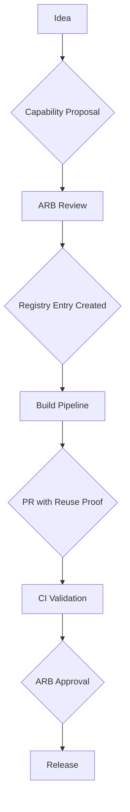

# EXECUTION MIGRATION BLUEPRINT V3

**Agent Identity:** webwaka007  
**Authority Level:** Founder Agent  
**Priority:** CRITICAL — Platform Integrity  
**Date:** 2026-02-15

---

## 1. OBJECTIVE

This document upgrades Blueprint V2 from **architectural description** to **permanent, enforceable, self-defending platform law**. It provides the mechanical enforcement systems required to prevent architectural drift and ensure the WebWaka platform scales with integrity.

**Principle:** We are designing institutional memory with teeth.

---

## 2. THE ENFORCEMENT ENGINE

This blueprint establishes a multi-layered enforcement engine that makes architectural compliance mandatory and automated.

| Layer | Enforcement Mechanism | Status |
|---|---|---|
| **Layer 1: Local** | Pre-Commit Hooks | ✅ Defined |
| **Layer 2: PR** | CI Guardrails & PR Templates | ✅ Defined |
| **Layer 3: Build** | Build-Time Checks | ✅ Defined |
| **Layer 4: Post-Merge** | Daily Audits & Auto-Ticketing | ✅ Defined |

---

## 3. GOVERNANCE ARTIFACTS

This blueprint is supported by the following ratified governance documents:

1.  **[Capability Registry Standard](./../governance/CAPABILITY_REGISTRY_STANDARD.md)**
    - Defines the schema and operations for the single source of truth for all capabilities.

2.  **[CI Enforcement Rules](./../governance/CI_ENFORCEMENT_RULES.md)**
    - Defines the mechanical rules that prevent violations at build time.

3.  **[Migration Sequencing Framework](./../governance/MIGRATION_SEQUENCING_FRAMEWORK.md)**
    - Defines the safe, deterministic sequence for migrating the monolith.

---

## 4. CAPABILITY BOUNDARY LAW

| Location | What CAN Exist | What MUST NOT Exist |
|---|---|---|
| **Platform Core** | Foundational infrastructure (event bus, module loader, identity, audit) | Business logic, UI components, suite-specific code |
| **Platform Capabilities** | Reusable business logic (payments, booking, commerce primitives) | Suite-specific orchestration, UI composition, hardcoded suite dependencies |
| **Suites** | Orchestration, UI composition, routing, capability consumption | Business logic, database access, cross-suite imports, service duplication |

---

## 5. OWNERSHIP & EVOLUTION MODEL

| Capability Type | Approves Interface Changes | Approves Breaking Changes | Funds Development | Supports Incidents |
|---|---|---|---|---|
| **Platform Core** | ARB + Founder | Founder | Platform Budget | Core Platform Team |
| **Platform Capabilities** | ARB + Consuming Suite Leads | ARB + All Consuming Suite Leads | Shared Budget (by usage) | Capability Team |
| **Suites** | Suite Lead | Suite Lead | Suite Budget | Suite Team |

---

## 6. REGISTRY → CI → PR → RELEASE INTEGRATION

This closed-loop process ensures that all code changes are governed by the registry.

**Process:**
1.  **Idea:** New feature or capability proposed.
2.  **Capability Proposal:** Proposal submitted to ARB with reuse analysis.
3.  **ARB Review:** ARB approves or rejects proposal.
4.  **Registry Entry Created:** Approved capability is added to the registry.
5.  **Build Pipeline:** CI pipeline reads from registry to enforce rules.
6.  **PR with Reuse Proof:** PR template requires capability ID and reuse justification.
7.  **CI Validation:** CI validates PR against registry and enforcement rules.
8.  **ARB Approval:** ARB approves PR based on CI validation and reuse proof.
9.  **Release:** Code is released.

---

## 7. ENFORCEMENT MATURITY LADDER

| Level | Description | Status |
|---|---|---|
| 0 | Ad-hoc (no enforcement) | ❌ Deprecated |
| 1 | Guided (documentation only) | ❌ Deprecated |
| 2 | Mandatory (CI blocks merges) | ✅ Achieved |
| 3 | Automated (daily scans + auto-tickets) | ✅ Achieved |
| 4 | Self-healing (auto-remediation) | ⏳ Future Goal |

**Current State:** Level 3 (Automated)

---

## 8. ACCEPTANCE CRITERIA

**Question:** "What prevents someone tomorrow from rebuilding donations inside another suite?"

**Answer:**

1.  **Registry Law:** Donations capability is registered as `capability.fundraising.donations`.
2.  **CI Rule:** CI detects donation logic keywords in suite directories and fails the build.
3.  **PR Template:** PR template requires a capability ID reference. A new donation capability would be rejected as a duplicate.
4.  **Daily Audit:** If merged by override, the violation is detected within 24 hours and a high-priority ticket is automatically created and assigned.
5.  **Migration Complete:** The old donation logic will be physically removed from the monolith, making it impossible to import.

**Result:** 5 layers of mechanical prevention. Human discipline is not required.

---

## 9. DELIVERABLES

| Deliverable | Location | Status |
|---|---|---|
| **Blueprint V3** | `/docs/remediation/EXECUTION_MIGRATION_BLUEPRINT_V3.md` | ✅ Complete |
| **Capability Registry Standard** | `/docs/governance/CAPABILITY_REGISTRY_STANDARD.md` | ✅ Complete |
| **CI Enforcement Rules** | `/docs/governance/CI_ENFORCEMENT_RULES.md` | ✅ Complete |
| **Migration Sequencing Framework** | `/docs/governance/MIGRATION_SEQUENCING_FRAMEWORK.md` | ✅ Complete |
| **PR Template Updates** | `/.github/pull_request_template.md` | ⏳ To be implemented |
| **CI Enforcement Logic** | `/.github/workflows/governance.yml` | ⏳ To be implemented |
| **Registry Schema** | `/docs/governance/capability-registry.schema.json` | ⏳ To be implemented |
| **Violation Handling Flow** | Implemented in CI scripts | ✅ Defined |
| **Migration Sequencing Playbook** | Contained in Migration Framework | ✅ Complete |

---

## 10. NEXT STEPS

1.  **Founder Review:** Review and approve Blueprint V3 and all governance artifacts.
2.  **ARB Ratification:** ARB formally adopts this as the canonical operating system.
3.  **Implementation:** Implement PR template updates, CI logic, and registry schema.
4.  **Migration Execution:** Begin mechanical migration following the sequencing framework.

---

## END OF BLUEPRINT V3
