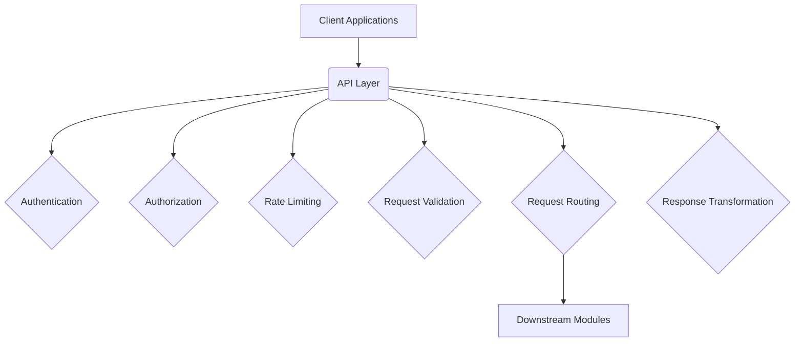

# API Layer Documentation

**Module:** API Layer (Module 7)  
**Author:** webwakaagent3 (Documentation & Knowledge Management)  
**Date:** 2026-02-16

## 1. Introduction

The API Layer is a critical component of the WebWaka platform, serving as the unified entry point for all client-side applications and external services. It provides a secure, reliable, and scalable interface for interacting with the platform's backend modules. This document provides comprehensive documentation for the API Layer, including its architecture, features, and usage.

### 1.1. Purpose

The primary purpose of the API Layer is to abstract the complexity of the backend services and provide a consistent, well-defined API for all clients. It is responsible for handling cross-cutting concerns such as authentication, authorization, rate limiting, request validation, and response transformation.

### 1.2. Scope

This document covers the following aspects of the API Layer:

-   **Architecture:** High-level overview of the API Layer's components and their interactions.
-   **Features:** Detailed description of the API Layer's features and capabilities.
-   **API Reference:** Comprehensive reference for all API endpoints, including request and response formats.
-   **Usage Examples:** Practical examples of how to use the API Layer.

### 1.3. Audience

This document is intended for the following audiences:

-   **Frontend Developers:** To understand how to interact with the API Layer from client-side applications.
-   **Backend Developers:** To understand how to integrate their modules with the API Layer.
-   **System Administrators:** To understand how to configure and manage the API Layer.
-   **Security Engineers:** To understand the security mechanisms implemented in the API Layer.

## 2. Architecture

The API Layer is designed as a modular, extensible, and scalable component that sits in front of all other backend services. It is built on top of NestJS, a progressive Node.js framework for building efficient, reliable, and scalable server-side applications.

### 2.1. High-Level Diagram



### 2.2. Core Components

The API Layer is composed of the following core components:

| Component | Description |
| --- | --- |
| **API Gateway** | The main orchestration service that processes all incoming requests through the pipeline. |
| **Authentication Service** | Handles JWT-based authentication, token validation, and tenant/user extraction. |
| **Authorization Service** | Integrates with the WEEG (Permission System) to perform permission checks. |
| **Rate Limiter Service** | Provides distributed rate limiting per tenant and per user using Redis. |
| **Request Validator Service** | Validates the format and content of incoming requests. |
| **Request Router Service** | Routes requests to the appropriate downstream modules based on the request path and method. |
| **Response Transformer Service** | Transforms responses into a consistent format for all clients. |
| **Request Logger Service** | Provides structured logging for all requests and responses. |
| **CORS Middleware** | Handles Cross-Origin Resource Sharing (CORS) for all requests. |
| **Health Check Service** | Provides endpoints for monitoring the health of the API Layer. |
| **Metrics Collector Service** | Collects performance metrics for monitoring and analysis. |
| **OpenAPI Generator** | Automatically generates API documentation in OpenAPI/Swagger format. |

## 3. Features

The API Layer provides a rich set of features to ensure the security, reliability, and scalability of the WebWaka platform.

### 3.1. Authentication

-   **JWT-based:** All authenticated requests must include a valid JSON Web Token (JWT) in the `Authorization` header.
-   **Tenant & User Extraction:** The authentication service extracts the `tenantId` and `userId` from the JWT payload and includes them in the request context.
-   **Token Validation:** The service validates the token signature, expiration, and issuer.

### 3.2. Authorization

-   **WEEG Integration:** The authorization service integrates with the WEEG (Permission System) to perform permission checks for all authenticated requests.
-   **Permission-Driven:** All requests are authorized based on the user's permissions, ensuring that users can only access the resources they are allowed to.

### 3.3. Rate Limiting

-   **Distributed:** The rate limiter service uses Redis to provide distributed rate limiting across multiple instances of the API Layer.
-   **Per-Tenant & Per-User:** Rate limits can be configured on a per-tenant and per-user basis.
-   **Fail-Open:** The service is designed to fail-open, meaning that if the Redis connection is lost, requests will be allowed to pass through.

### 3.4. Request Validation

-   **Comprehensive:** The request validator service validates the body, query, and path parameters of all incoming requests.
-   **Type Checking:** The service checks the types of all parameters, including strings, numbers, booleans, arrays, and objects.
-   **Format Validation:** The service validates the format of all parameters, including UUIDs, emails, and other common formats.

### 3.5. Request Routing

-   **Dynamic:** The request router service provides dynamic route registration, allowing new routes to be added without restarting the service.
-   **Pattern Matching:** The service supports pattern matching for parameterized routes, allowing for flexible and powerful routing rules.
-   **API Versioning:** The service supports API versioning, allowing multiple versions of the API to be exposed simultaneously.

### 3.6. Response Transformation

-   **Consistent:** The response transformer service transforms all responses into a consistent format, ensuring that clients receive a predictable response structure.
-   **Success & Error Responses:** The service provides standardized success and error response formats.
-   **Pagination:** The service supports pagination for paginated responses, including metadata about the current page, page size, total items, and total pages.

### 3.7. Logging & Monitoring

-   **Structured Logging:** The request logger service provides structured logging for all requests and responses, including the request context, status code, and duration.
-   **Metrics Collection:** The metrics collector service collects performance metrics for all requests, including the request count, latency, and error rate.
-   **Health Checks:** The health check service provides endpoints for monitoring the health of the API Layer and its dependencies.

### 3.8. API Documentation

-   **OpenAPI/Swagger:** The OpenAPI generator service automatically generates API documentation in OpenAPI/Swagger format.
-   **HTML Documentation:** The service also generates HTML documentation that can be viewed in a browser.

## 4. API Reference

This section provides a comprehensive reference for the API Layer, including the standard response formats, authentication header, and a complete list of all API endpoints.

### 4.1. Response Formats

#### 4.1.1. Success Response

All successful responses from the API Layer will have the following format:

```json
{
  "data": { ... },
  "meta": {
    "timestamp": "2026-02-16T12:00:00.000Z",
    "requestId": "uuid",
    "version": "v1",
    "pagination": {
      "page": 1,
      "pageSize": 10,
      "total": 100,
      "totalPages": 10,
      "hasNext": true,
      "hasPrevious": false
    }
  }
}
```

| Field | Type | Description |
| --- | --- | --- |
| `data` | `object` | The response data. |
| `meta` | `object` | Metadata about the response. |
| `meta.timestamp` | `string` | The timestamp of the response in ISO 8601 format. |
| `meta.requestId` | `string` | A unique ID for the request, useful for tracing and debugging. |
| `meta.version` | `string` | The version of the API that generated the response. |
| `meta.pagination` | `object` | Pagination metadata for paginated responses. |

#### 4.1.2. Error Response

All error responses from the API Layer will have the following format:

```json
{
  "error": {
    "code": "ERROR_CODE",
    "message": "Error message",
    "details": { ... },
    "timestamp": "2026-02-16T12:00:00.000Z",
    "requestId": "uuid"
  }
}
```

| Field | Type | Description |
| --- | --- | --- |
| `error` | `object` | The error details. |
| `error.code` | `string` | A unique code for the error. |
| `error.message` | `string` | A human-readable message for the error. |
| `error.details` | `object` | Additional details about the error. |
| `error.timestamp` | `string` | The timestamp of the error in ISO 8601 format. |
| `error.requestId` | `string` | A unique ID for the request, useful for tracing and debugging. |

### 4.2. Authentication

All authenticated requests must include an `Authorization` header with a valid JWT token:

```
Authorization: Bearer <jwt_token>
```

### 4.3. API Endpoints

The complete list of API endpoints is available in the generated OpenAPI/Swagger documentation. The OpenAPI generator service automatically generates this documentation based on the registered routes in the API Layer.

## 5. Usage Examples

This section provides practical examples of how to use the API Layer.

### 5.1. Making an Authenticated Request

To make an authenticated request, you must include a valid JWT token in the `Authorization` header.

```javascript
const token = 'your_jwt_token';

fetch('https://api.webwaka.com/api/v1/users', {
  headers: {
    'Authorization': `Bearer ${token}`
  }
})
.then(response => response.json())
.then(data => console.log(data));
```

### 5.2. Handling Paginated Responses

When you receive a paginated response, you can use the `meta.pagination` object to navigate through the pages.

```javascript
function fetchUsers(page = 1) {
  fetch(`https://api.webwaka.com/api/v1/users?page=${page}`)
  .then(response => response.json())
  .then(response => {
    console.log(response.data); // The list of users

    if (response.meta.pagination.hasNext) {
      // Fetch the next page
      fetchUsers(response.meta.pagination.page + 1);
    }
  });
}
```

### 5.3. Handling Errors

When you receive an error response, you can use the `error` object to get more information about the error.

```javascript
fetch('https://api.webwaka.com/api/v1/users/invalid-id')
.then(response => response.json())
.then(response => {
  if (response.error) {
    console.error(response.error.message);
  }
});
```
