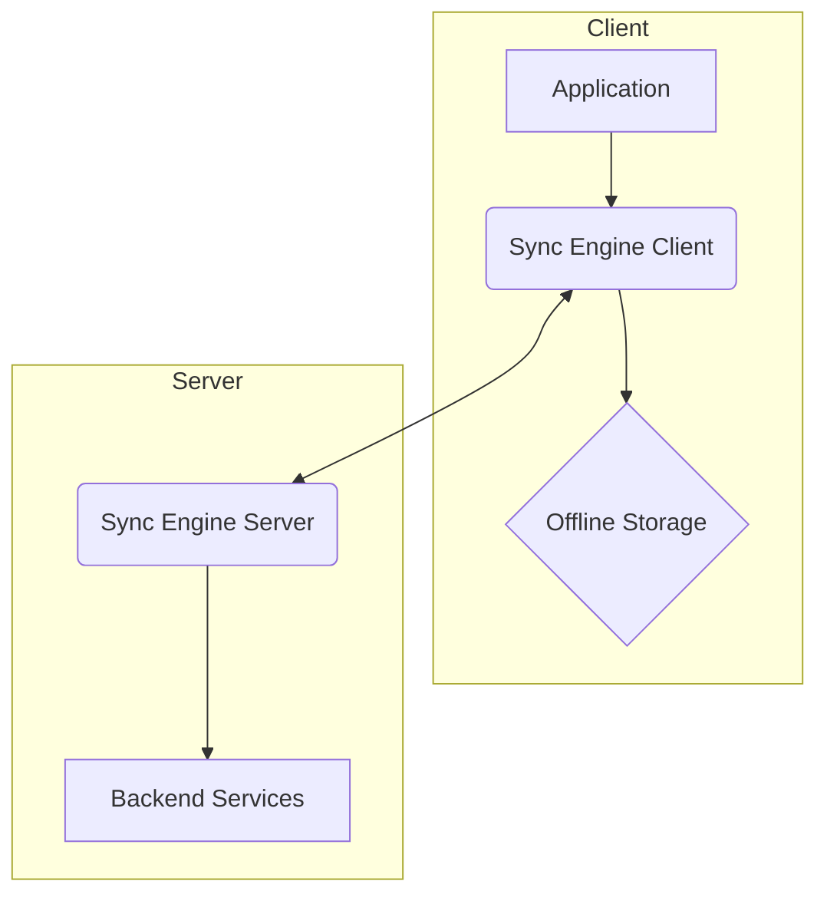
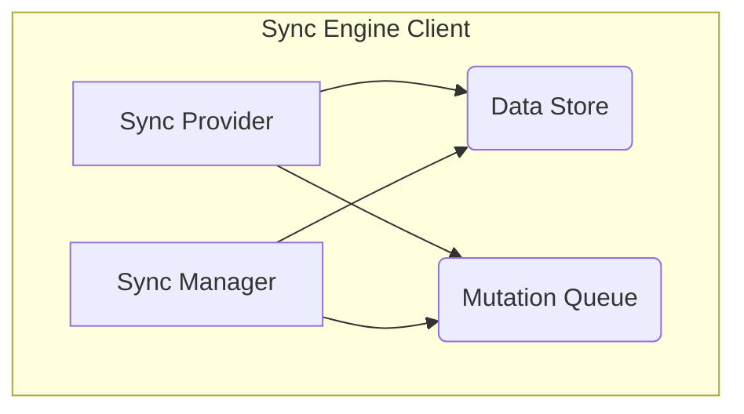
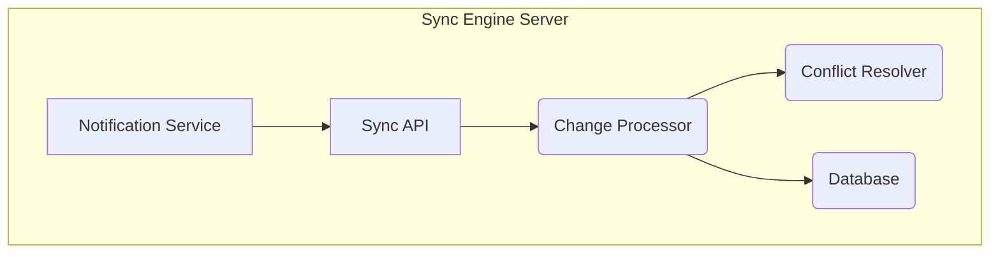

# Offline-First Sync Engine Documentation

**Module ID:** Module 8  
**Module Name:** Offline-First Sync Engine  
**Version:** 1.0  
**Date:** 2026-02-10  
**Author:** webwakaagent3 (Architecture)

---

## 1. Introduction

The Offline-First Sync Engine is a core module of the WebWaka platform responsible for synchronizing data between the client-side (browser, PWA) and the backend services. It ensures that the platform remains fully functional in low-connectivity environments, a critical requirement for the African market. This document provides a comprehensive overview of the Sync Engine's architecture, features, and usage.

### 1.1 Target Audience

This documentation is intended for:

-   **Frontend Developers:** To understand how to integrate the Sync Engine client into their applications.
-   **Backend Developers:** To understand how to integrate their services with the Sync Engine server.
-   **System Administrators:** To understand how to configure and monitor the Sync Engine.
-   **Quality Engineers:** To understand how to test the Sync Engine.

## 2. Architecture

The Sync Engine is composed of two main components: the Sync Engine Client and the Sync Engine Server. The client is a lightweight library that runs in the user's browser and manages offline storage and data synchronization. The server is a backend service that handles data synchronization and conflict resolution.

### 2.1 High-Level Architecture



**Components:**

-   **Sync Engine Client:** A client-side library that integrates with the application and manages offline storage and data synchronization.
-   **Offline Storage:** A client-side database (IndexedDB) that stores data offline.
-   **Sync Engine Server:** A backend service that handles data synchronization and conflict resolution.
-   **Backend Services:** The application's backend services that provide the data to be synchronized.

**Data Flow:**

1.  The application reads and writes data to the Sync Engine Client.
2.  The Sync Engine Client stores the data in the Offline Storage.
3.  The Sync Engine Client synchronizes the data with the Sync Engine Server.
4.  The Sync Engine Server communicates with the Backend Services to get the latest data.

### 2.2 Component Details

#### 2.2.1 Sync Engine Client

The Sync Engine Client is responsible for:

-   Providing a simple API for the application to read and write data.
-   Managing the Offline Storage.
-   Synchronizing data with the Sync Engine Server.
-   Handling offline mutations.

#### 2.2.2 Offline Storage

The Offline Storage is responsible for:

-   Storing data offline.
-   Providing a simple API for the Sync Engine Client to read and write data.

#### 2.2.3 Sync Engine Server

The Sync Engine Server is responsible for:

-   Handling data synchronization from multiple clients.
-   Resolving data conflicts.
-   Communicating with the Backend Services to get the latest data.

## 3. Features

The Sync Engine provides the following features:

-   **Offline-First:** The Sync Engine is designed to work offline-first, meaning that the application remains fully functional even when the user is not connected to the internet.
-   **Two-Way Data Synchronization:** The Sync Engine supports two-way data synchronization between the client and server.
-   **Conflict Resolution:** The Sync Engine provides a mechanism for resolving data conflicts.
-   **Delta Synchronization:** The Sync Engine uses delta synchronization to minimize data transfer.
-   **Real-Time Updates:** The Sync Engine provides real-time updates to the client.

## 4. API Reference

### 4.1 REST API Endpoints

#### 4.1.1 Get Changes

**Method:** GET  
**Path:** `/api/v1/sync/changes`  
**Description:** Gets the changes that have occurred since the last sync.

**Request:**

```json
{
  "lastSyncTimestamp": "2026-02-16T12:00:00.000Z"
}
```

**Response (Success):**

```json
{
  "status": "success",
  "data": {
    "changes": [
      {
        "type": "create",
        "entity": "products",
        "data": { ... }
      },
      {
        "type": "update",
        "entity": "products",
        "data": { ... }
      },
      {
        "type": "delete",
        "entity": "products",
        "id": "uuid"
      }
    ]
  }
}
```

#### 4.1.2 Post Changes

**Method:** POST  
**Path:** `/api/v1/sync/changes`  
**Description:** Posts the changes that have occurred on the client since the last sync.

**Request:**

```json
{
  "changes": [
    {
      "type": "create",
      "entity": "products",
      "data": { ... }
    },
    {
      "type": "update",
      "entity": "products",
      "data": { ... }
    },
    {
      "type": "delete",
      "entity": "products",
      "id": "uuid"
    }
  ]
}
```

**Response (Success):**

```json
{
  "status": "success"
}
```

### 4.2 Event-Based API

#### 4.2.1 Data Changed

**Event Type:** `data.changed`  
**Description:** This event is triggered when data changes on the server.

**Payload:**

```json
{
  "eventType": "data.changed",
  "timestamp": "2026-02-16T12:00:00Z",
  "data": {
    "changes": [
      {
        "type": "create",
        "entity": "products",
        "data": { ... }
      },
      {
        "type": "update",
        "entity": "products",
        "data": { ... }
      },
      {
        "type": "delete",
        "entity": "products",
        "id": "uuid"
      }
    ]
  }
}
```

## 5. Usage Examples

### 5.1 Initializing the Sync Engine Client

```typescript
import { SyncEngineClientService } from "@webwaka/sync-engine";

const syncEngine = new SyncEngineClientService(
  {
    syncInterval: 5000, // 5 seconds
    maxRetries: 3,
    conflictResolution: "last-write-wins",
  },
  "tenant-123",
  "user-456"
);

await syncEngine.initialize();
```

### 5.2 Creating a New Item

```typescript
const product = await syncEngine.create("products", {
  name: "My Product",
  price: 100,
});
```

### 5.3 Updating an Item

```typescript
const updatedProduct = await syncEngine.update("products", product.id, {
  price: 150,
});
```

### 5.4 Deleting an Item

```typescript
await syncEngine.delete("products", product.id);
```

### 5.5 Getting an Item

```typescript
const product = await syncEngine.get("products", product.id);
```

### 5.6 Getting All Items

```typescript
const products = await syncEngine.getAll("products");
```

### 2.3 Client-Side Architecture

The client-side architecture of the Sync Engine is designed to be lightweight and efficient. It consists of the following components:

- **Sync Provider:** The main entry point for the application to interact with the Sync Engine. It provides a simple API for creating, reading, updating, and deleting data.
- **Data Store:** An abstraction layer over the underlying storage mechanism (IndexedDB). It provides a consistent API for storing and retrieving data.
- **Mutation Queue:** A queue for storing offline mutations. When the application is offline, all mutations are added to this queue. When the application comes back online, the mutations are sent to the server in the order they were created.
- **Sync Manager:** Responsible for coordinating the synchronization process. It periodically checks for new changes on the server and sends any pending mutations from the client.



### 2.4 Server-Side Architecture

The server-side architecture of the Sync Engine is designed to be scalable and reliable. It consists of the following components:

- **Sync API:** A RESTful API for receiving changes from clients and sending changes to clients.
- **Change Processor:** Responsible for processing incoming changes from clients. It validates the changes, resolves any conflicts, and applies the changes to the database.
- **Conflict Resolver:** A pluggable component that implements the conflict resolution strategy. The default strategy is last-write-wins, but custom strategies can be implemented.
- **Notification Service:** Responsible for sending real-time updates to clients. It uses WebSockets to push changes to clients as they happen.



## 3. Features in Detail

### 3.1 Offline-First

The Sync Engine is designed with an offline-first approach, ensuring that the application remains fully functional even when the user is not connected to the internet. All data is stored locally in an IndexedDB database, and all mutations (creates, updates, deletes) are queued locally. When the connection is restored, the queued mutations are automatically synchronized with the server.

### 3.2 Two-Way Data Synchronization

The Sync Engine provides seamless two-way data synchronization between the client and the server. This means that any changes made on the client are automatically pushed to the server, and any changes made on the server are automatically pulled by the client. This ensures that the data is always consistent across all devices.

### 3.3 Conflict Resolution

Data conflicts can occur when the same data is modified on multiple clients at the same time. The Sync Engine provides a flexible conflict resolution mechanism to handle these situations. The default strategy is **last-write-wins**, where the most recent change overwrites any previous changes. However, developers can implement their own custom conflict resolution strategies to meet the specific needs of their application.

### 3.4 Delta Synchronization

To minimize data transfer and improve performance, the Sync Engine uses delta synchronization. This means that only the changes (deltas) are transferred between the client and the server, rather than the entire dataset. This is particularly important in low-bandwidth environments, where every byte counts.

### 3.5 Real-Time Updates

The Sync Engine provides real-time updates to the client using WebSockets. This means that as soon as data changes on the server, the changes are pushed to all connected clients in real-time. This is ideal for collaborative applications where users need to see the latest data as it changes.

## 4. API Reference

### 4.1 Client-Side API (TypeScript)

The Sync Engine client provides a simple and intuitive API for interacting with the Sync Engine. The main service is `SyncEngineClientService`, which is used to initialize the client and perform CRUD operations.

#### `SyncEngineClientService`

**`constructor(config: SyncEngineConfig, tenantId: string, userId: string)`**

-   `config`: An object containing the configuration for the Sync Engine client.
-   `tenantId`: The ID of the tenant.
-   `userId`: The ID of the user.

**`initialize(): Promise<void>`**

Initializes the Sync Engine client. This method should be called before any other methods.

**`create(entity: string, data: any): Promise<any>`**

Creates a new item.

-   `entity`: The name of the entity to create.
-   `data`: The data for the new item.

**`update(entity: string, id: string, data: any): Promise<any>`**

Updates an existing item.

-   `entity`: The name of the entity to update.
-   `id`: The ID of the item to update.
-   `data`: The new data for the item.

**`delete(entity: string, id: string): Promise<void>`**

Deletes an item.

-   `entity`: The name of the entity to delete.
-   `id`: The ID of the item to delete.

**`get(entity: string, id: string): Promise<any>`**

Gets a single item.

-   `entity`: The name of the entity to get.
-   `id`: The ID of the item to get.

**`getAll(entity: string): Promise<any[]>`**

Gets all items of a given entity.

-   `entity`: The name of the entity to get.

### 4.2 Server-Side API (REST)

The Sync Engine server exposes a RESTful API for clients to synchronize their data.

#### GET `/api/v1/sync/changes`

Gets the changes that have occurred since the last sync.

**Query Parameters:**

-   `lastSyncTimestamp`: The timestamp of the last sync.

**Response:**

```json
{
  "status": "success",
  "data": {
    "changes": [
      {
        "type": "create",
        "entity": "products",
        "data": { ... }
      },
      {
        "type": "update",
        "entity": "products",
        "data": { ... }
      },
      {
        "type": "delete",
        "entity": "products",
        "id": "uuid"
      }
    ]
  }
}
```

#### POST `/api/v1/sync/changes`

Posts the changes that have occurred on the client since the last sync.

**Request Body:**

```json
{
  "changes": [
    {
      "type": "create",
      "entity": "products",
      "data": { ... }
    },
    {
      "type": "update",
      "entity": "products",
      "data": { ... }
    },
    {
      "type": "delete",
      "entity": "products",
      "id": "uuid"
    }
  ]
}
```

**Response:**

```json
{
  "status": "success"
}
```

## 5. Usage Examples

### 5.1 Initializing the Sync Engine Client

To get started with the Sync Engine, you first need to initialize the `SyncEngineClientService`. This service is the main entry point for all interactions with the Sync Engine.

```typescript
import { SyncEngineClientService } from "@webwaka/sync-engine";

// Configuration for the Sync Engine client
const config = {
  syncInterval: 5000, // Sync every 5 seconds
  maxRetries: 3, // Retry failed syncs 3 times
  conflictResolution: "last-write-wins", // Default conflict resolution strategy
};

// Tenant and user IDs
const tenantId = "tenant-123";
const userId = "user-456";

// Create a new instance of the Sync Engine client
const syncEngine = new SyncEngineClientService(config, tenantId, userId);

// Initialize the client
await syncEngine.initialize();
```

### 5.2 Creating a New Item

To create a new item, you can use the `create` method. This method will add the new item to the local database and queue a mutation to be sent to the server.

```typescript
const product = await syncEngine.create("products", {
  name: "My Product",
  price: 100,
});

console.log("Created product:", product);
```

### 5.3 Updating an Item

To update an existing item, you can use the `update` method. This method will update the item in the local database and queue a mutation to be sent to the server.

```typescript
const updatedProduct = await syncEngine.update("products", product.id, {
  price: 150,
});

console.log("Updated product:", updatedProduct);
```

### 5.4 Deleting an Item

To delete an item, you can use the `delete` method. This method will delete the item from the local database and queue a mutation to be sent to the server.

```typescript
await syncEngine.delete("products", product.id);

console.log("Deleted product");
```

### 5.5 Getting an Item

To get a single item, you can use the `get` method. This method will retrieve the item from the local database.

```typescript
const product = await syncEngine.get("products", product.id);

console.log("Got product:", product);
```

### 5.6 Getting All Items

To get all items of a given entity, you can use the `getAll` method. This method will retrieve all items of the given entity from the local database.

```typescript
const products = await syncEngine.getAll("products");

console.log("Got all products:", products);
```

## 6. Conflict Resolution

Data conflicts are an inevitable part of any synchronization system. The Sync Engine provides a flexible and powerful conflict resolution mechanism to handle these situations. The default strategy is **last-write-wins**, but you can also implement your own custom conflict resolution strategies.

### 6.1 Last-Write-Wins

The last-write-wins strategy is the simplest and most common conflict resolution strategy. It simply means that the most recent change wins. For example, if two users modify the same record at the same time, the change that was saved last will overwrite the other change.

### 6.2 Custom Conflict Resolution

For more complex scenarios, you can implement your own custom conflict resolution strategy. To do this, you need to provide a `conflictHandler` function in the Sync Engine configuration. This function will be called whenever a conflict is detected. The function will receive the two conflicting versions of the record, and it should return the version that you want to keep.

```typescript
const config = {
  // ...
  conflictHandler: (serverVersion, clientVersion) => {
    // In this example, we'll merge the two versions together
    return { ...serverVersion, ...clientVersion };
  },
};
```

## 7. Security

Security is a top priority for the WebWaka platform, and the Sync Engine is no exception. The Sync Engine implements a number of security features to protect your data from unauthorized access.

### 7.1 Authentication

All requests to the Sync Engine server are authenticated to ensure that only authorized users can access the data. The Sync Engine uses a token-based authentication system, where each user is issued a unique access token. This token must be included in all requests to the server.

### 7.2 Authorization

In addition to authentication, the Sync Engine also implements a robust authorization system. This means that even if a user is authenticated, they will only be able to access the data that they are authorized to see. The Sync Engine uses a role-based access control (RBAC) system, where each user is assigned a role. Each role has a set of permissions that determine what data the user can access.

### 7.3 Encryption

All data is encrypted both in transit and at rest. When data is sent between the client and the server, it is encrypted using TLS. When data is stored in the local database on the client, it is encrypted using AES-256.

## 8. Best Practices

To get the most out of the Sync Engine, it's important to follow these best practices:

- **Keep your data models simple:** The Sync Engine is designed to work with simple data models. Avoid complex relationships and nested objects, as this can make synchronization more difficult.
- **Use a consistent naming convention:** Use a consistent naming convention for your entities and attributes. This will make it easier to work with the Sync Engine and will help to prevent errors.
- **Implement a custom conflict resolution strategy:** The default last-write-wins strategy is not always the best choice. For complex applications, it's important to implement a custom conflict resolution strategy that meets the specific needs of your application.
- **Monitor your sync performance:** The Sync Engine provides a number of metrics that you can use to monitor your sync performance. Use these metrics to identify and resolve any performance bottlenecks.
