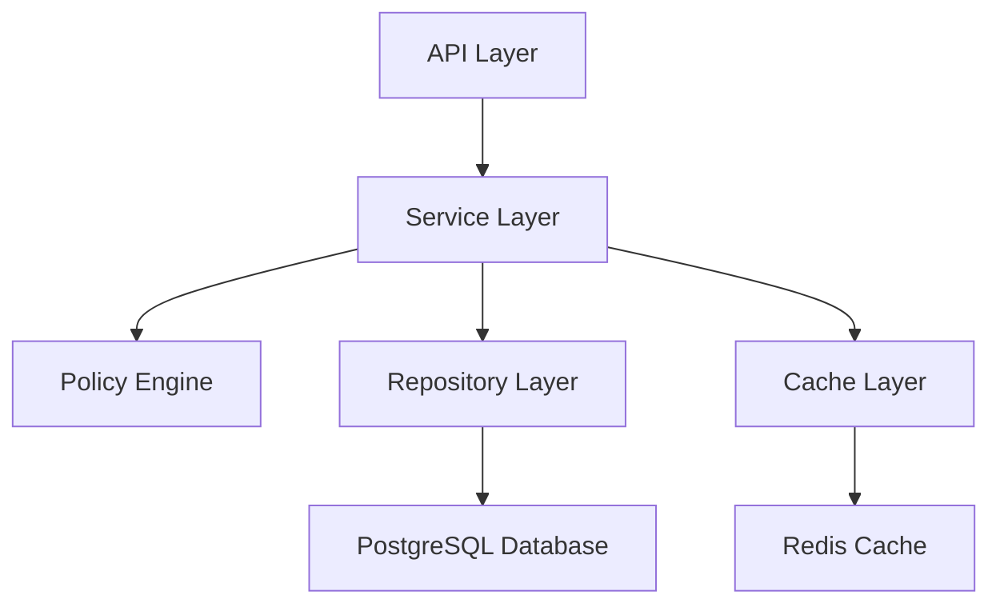

# WEEG (Permission System) - Module Documentation

**Module ID:** Module 6  
**Module Name:** WEEG (Permission System)  
**Version:** 1.0.0  
**Date:** 2026-02-15  
**Author:** webwakaagent3 (Architecture Agent)  
**Status:** DRAFT

---

## 1. Introduction

The WEEG (Permission System) is the centralized authority for managing all permissions, roles, and access control policies across the WebWaka platform. It provides a flexible and scalable framework for defining what actions users and services are allowed to perform, ensuring that all operations are secure and compliant with the **Permission-Driven** architectural invariant. This module is the single source of truth for all authorization decisions.

### 1.1 Purpose

The primary purpose of WEEG is to decouple authorization logic from business logic. By providing a centralized permission management system, WEEG enables:

- **Consistent Authorization:** All modules use the same permission checking mechanism.
- **Simplified Development:** Developers can focus on business logic without worrying about authorization.
- **Centralized Auditing:** All permission changes are logged in one place.
- **Flexible Access Control:** Supports both Role-Based Access Control (RBAC) and Attribute-Based Access Control (ABAC).

### 1.2 Key Features

- **Role-Based Access Control (RBAC):** Assign permissions to roles and roles to users.
- **Attribute-Based Access Control (ABAC):** Define policies based on user, resource, and environment attributes.
- **Centralized Policy Enforcement:** A single API endpoint for checking permissions.
- **High Performance:** <50ms P99 latency for permission checks.
- **Multi-Tenant:** All permission data is strictly scoped by `tenantId`.
- **Full Audit Trail:** All permission changes are logged for compliance.
- **Wildcard Permissions:** Support for `*` and `user.*` style permissions.

---

## 2. Architecture

The WEEG module follows a clean, layered architecture designed for performance, scalability, and testability.

### 2.1 High-Level Architecture



**Layers:**

1.  **API Layer:** Exposes the WEEG functionality via a RESTful API.
2.  **Service Layer:** Contains the core business logic and orchestrates the other layers.
3.  **Policy Engine:** The core authorization logic for evaluating permissions.
4.  **Repository Layer:** Handles all communication with the PostgreSQL database.
5.  **Cache Layer:** Provides a high-performance caching layer using Redis.

### 2.2 Data Model

The WEEG data model is designed to be flexible and scalable. The key entities are:

- **Role:** A collection of permissions.
- **Permission:** A specific action that can be performed.
- **Policy:** A mapping between a role and a permission.
- **UserRole:** A mapping between a user and a role.
- **AbacRule:** An attribute-based access control rule.
- **AuditLog:** A record of a change to the permission system.

---

## 3. API Documentation

The WEEG module exposes a comprehensive RESTful API for managing permissions, roles, and policies.

### 3.1 Authentication

All API requests must be authenticated with a valid JWT token. The `tenantId` and `userId` are extracted from the token.

### 3.2 Endpoints

#### 3.2.1 Permission Check

**POST /api/weeg/check**

Checks if a user has permission to perform an action.

**Request Body:**

```json
{
  "tenantId": "...",
  "userId": "...",
  "action": "user.create",
  "resourceAttributes": { ... },
  "userAttributes": { ... },
  "environmentAttributes": { ... }
}
```

**Response:**

```json
{
  "allowed": true,
  "reason": "User has 'admin' role"
}
```

#### 3.2.2 Role Management

- **GET /api/weeg/roles:** List all roles for a tenant.
- **GET /api/weeg/roles/:roleId:** Get a specific role.
- **POST /api/weeg/roles:** Create a new role.
- **PUT /api/weeg/roles/:roleId:** Update a role.
- **DELETE /api/weeg/roles/:roleId:** Delete a role.

#### 3.2.3 Permission Management

- **GET /api/weeg/permissions:** List all available permissions.
- **POST /api/weeg/permissions:** Create a new permission.

#### 3.2.4 Policy Management

- **POST /api/weeg/policies:** Assign a permission to a role.
- **DELETE /api/weeg/policies/:policyId:** Remove a permission from a role.

#### 3.2.5 User Role Management

- **GET /api/weeg/users/:userId/roles:** Get all roles for a user.
- **POST /api/weeg/users/:userId/roles:** Assign a role to a user.
- **DELETE /api/weeg/users/:userId/roles/:roleId:** Remove a role from a user.

#### 3.2.6 ABAC Rule Management

- **GET /api/weeg/abac-rules:** List all ABAC rules for a tenant.
- **POST /api/weeg/abac-rules:** Create a new ABAC rule.
- **PUT /api/weeg/abac-rules/:ruleId:** Update an ABAC rule.
- **DELETE /api/weeg/abac-rules/:ruleId:** Delete an ABAC rule.

---

## 4. Usage Examples

### 4.1 Checking a Permission

```typescript
import axios from 'axios';

async function checkPermission() {
  const response = await axios.post(
    'https://api.webwaka.com/api/weeg/check',
    {
      tenantId: 'tenant-123',
      userId: 'user-456',
      action: 'user.create',
    },
    {
      headers: {
        Authorization: 'Bearer ...',
      },
    }
  );

  if (response.data.allowed) {
    console.log('Permission granted!');
  } else {
    console.log('Permission denied!');
  }
}
```

### 4.2 Creating a Role

```typescript
import axios from 'axios';

async function createRole() {
  const response = await axios.post(
    'https://api.webwaka.com/api/weeg/roles',
    {
      tenantId: 'tenant-123',
      name: 'Editor',
      description: 'Can edit content',
      actorId: 'admin-user-789',
    },
    {
      headers: {
        Authorization: 'Bearer ...',
      },
    }
  );

  console.log('Role created:', response.data.role);
}
```

---

## 5. Deployment

### 5.1 Dependencies

- **PostgreSQL:** For data persistence.
- **Redis:** For caching.

### 5.2 Configuration

The WEEG module is configured via environment variables:

- `WEEG_DATABASE_URL`: PostgreSQL connection URL.
- `WEEG_REDIS_URL`: Redis connection URL.
- `WEEG_CACHE_TTL`: Default cache TTL in seconds (default: 300).

### 5.3 Database Migrations

Database migrations are located in `src/modules/weeg/repository/migrations`. They should be run automatically on deployment.

---

## 6. Development

### 6.1 Getting Started

1. Clone the `webwaka-platform` repository.
2. Install dependencies: `npm install`
3. Set up PostgreSQL and Redis (e.g., with Docker Compose).
4. Run migrations.
5. Run the application: `npm run dev`

### 6.2 Running Tests

- **Unit Tests:** `npm test -- src/modules/weeg/__tests__`
- **Integration Tests:** `npm test -- src/modules/weeg/__tests__/integration`
- **Coverage:** `npm test -- --coverage`

---

## 7. References

- [1] WEEG Specification (https://github.com/WebWakaHub/webwaka-governance/blob/master/specifications/WEEG_SPECIFICATION.md)
- [2] WEEG Test Strategy (https://github.com/WebWakaHub/webwaka-governance/blob/master/test-strategies/WEEG_TEST_STRATEGY.md)
