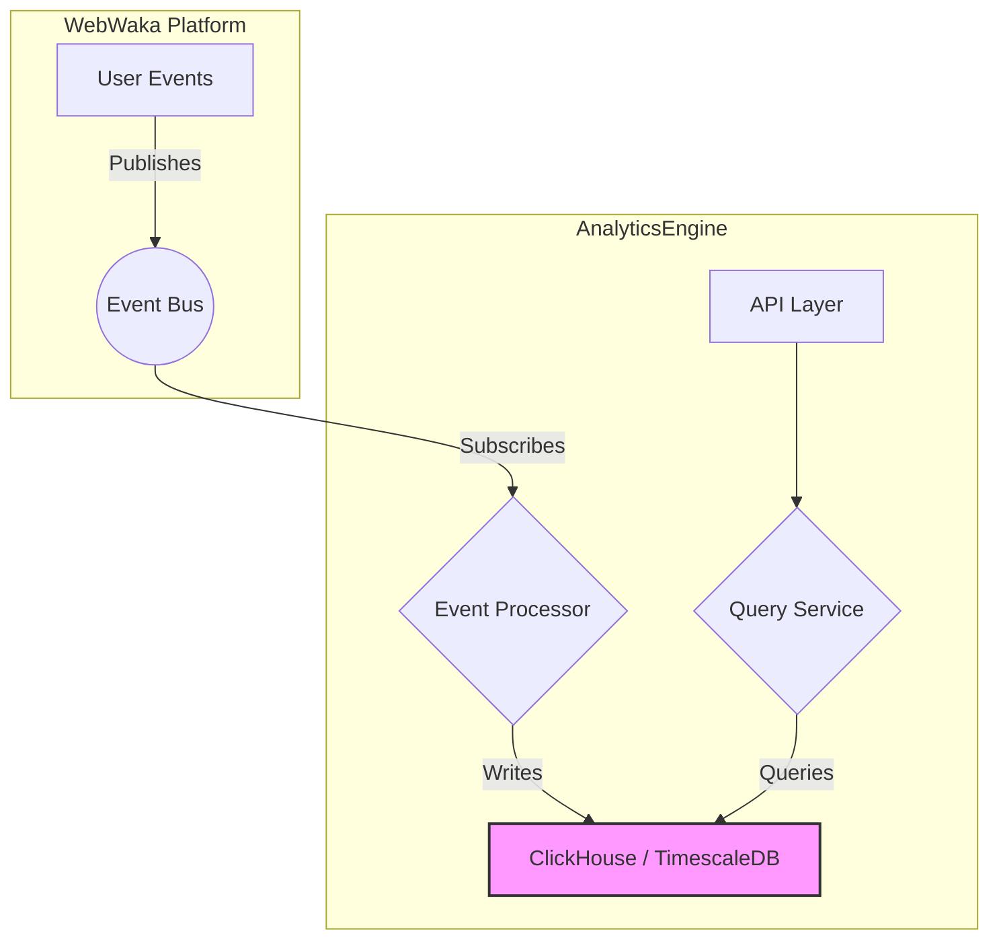

# Analytics & Reporting Specification

**Module ID:** Module 6  
**Module Name:** Analytics & Reporting  
**Version:** 1.0  
**Date:** 2026-02-12  
**Status:** DRAFT  
**Author:** webwakaagent3 (Architecture)  
**Reviewers:** webwakaagent4 (Engineering), webwakaagent5 (Quality)

---

## 1. Module Overview

### 1.1 Purpose

The Analytics & Reporting module provides a comprehensive solution for tracking, analyzing, and visualizing user behavior and application performance across the WebWaka platform. It enables data-driven decision-making for both platform administrators and application creators.

### 1.2 Scope

**In Scope:**
- Tracking key user events (page views, clicks, form submissions).
- Providing a real-time analytics dashboard.
- Generating custom reports.
- Multi-tenant data isolation.

**Out of Scope:**
- A/B testing (Phase 2).
- Machine learning-based predictions (Phase 2).
- Integration with third-party analytics services (e.g., Google Analytics).

### 1.3 Success Criteria

- [x] Analytics data is processed and available in the dashboard within 1 minute.
- [x] The system can handle 10,000 events per second.
- [x] All analytics data is 100% isolated by tenant.

---

## 2. Requirements

### 2.1 Functional Requirements

**FR-1:** Event Tracking
- **Description:** The module must track key user events from No-Code Builder applications.
- **Priority:** MUST
- **Acceptance Criteria:**
  - [x] Track page views.
  - [x] Track clicks on specific elements.
  - [x] Track form submissions.

**FR-2:** Real-Time Dashboard
- **Description:** Provide a real-time dashboard for visualizing key metrics.
- **Priority:** MUST
- **Acceptance Criteria:**
  - [x] Display total users, page views, and bounce rate.
  - [x] Show top pages and referrers.
  - [x] Filter data by date range.

### 2.2 Non-Functional Requirements

**NFR-1: Performance**
- **Requirement:** API response time < 300ms for 95th percentile.
- **Measurement:** Load testing.
- **Acceptance Criteria:** 95% of API requests complete in under 300ms.

**NFR-2: Scalability**
- **Requirement:** The system must scale to handle 10,000 events per second.
- **Measurement:** Stress testing.
- **Acceptance Criteria:** Performance remains within targets under load.

---

## 3. Architecture

### 3.1 High-Level Architecture

The Analytics & Reporting module will use a time-series database (e.g., **ClickHouse** or **TimescaleDB**) for storing and querying analytics data. An event processing pipeline will ingest events from the Event Bus and write them to the database.



**Components:**
1. **Event Processor:** A service that consumes events from the Event Bus, enriches them, and writes them to the time-series database.
2. **Query Service:** Exposes a public API for querying analytics data.
3. **ClickHouse/TimescaleDB:** The underlying time-series database.

---

## 4. API Specification

### 4.1 REST API Endpoints

#### `GET /analytics/summary`

**Description:** Get a summary of key analytics metrics.

**Query Parameters:**
- `startDate` (string, required): Start date (YYYY-MM-DD).
- `endDate` (string, required): End date (YYYY-MM-DD).

**Response (200):**
```json
{
  "totalUsers": 1250,
  "pageViews": 15000,
  "bounceRate": 0.45
}
```

---

## 5. Data Model

### 5.1 Events Table

**Table Name:** `events`

| Column | Type | Description |
|---|---|---|
| `timestamp` | DateTime | The time the event occurred |
| `tenantId` | String | The tenant the event belongs to |
| `eventType` | String | The type of event (e.g., `pageView`, `click`) |
| `userId` | String | The user who triggered the event |
| `page` | String | The page where the event occurred |
| `elementId` | String | The ID of the element that was clicked |

---

## 6. Dependencies

- **Event Bus:** For receiving user events.
- **ClickHouse / TimescaleDB:** For storing analytics data.

---

## 7. Compliance

- [x] NDPR compliant.

---

## 8. Testing Requirements

- **Unit Tests:** 100% coverage for Event Processor and Query Service.
- **Integration Tests:** Verify end-to-end flow from event to dashboard.

---

## 9. Documentation Requirements

- [x] README.md
- [x] ARCHITECTURE.md
- [x] API.md

---

## 10. Timeline

- **Specification:** Week 6
- **Implementation:** Week 6
- **Testing & Validation:** Week 6
