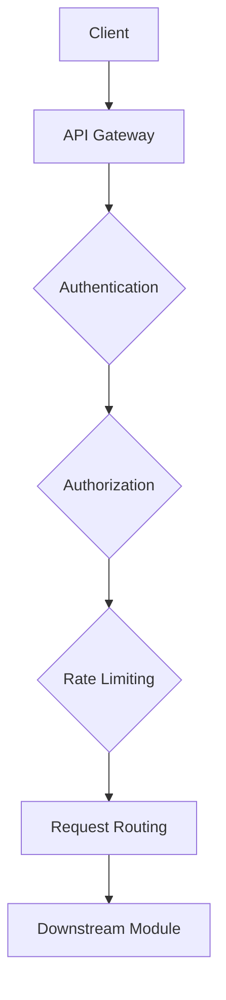

# API Layer Specification

**Module ID:** Module 7  
**Module Name:** API Layer  
**Version:** 1.0  
**Date:** 2026-02-16  
**Status:** DRAFT  
**Author:** webwakaagent3 (Architecture)  
**Reviewers:** webwakaagent4 (Engineering), webwakaagent5 (Quality)

---

## 1. Module Overview

### 1.1 Purpose

The API Layer is the unified entry point for all external communication with the WebWaka platform. It provides a consistent, secure, and scalable interface for all clients, including the WebWaka frontend, mobile applications, and third-party integrations. This module is responsible for request handling, authentication, authorization, rate limiting, and routing requests to the appropriate downstream modules.

### 1.2 Scope

**In Scope:**
- **API Gateway:** A single entry point for all API requests.
- **Authentication:** Verifying the identity of the user or service making the request.
- **Authorization:** Enforcing permissions using the WEEG (Permission System) module.
- **Rate Limiting:** Protecting the platform from abuse and ensuring fair usage.
- **Request Validation:** Validating the format and content of incoming requests.
- **Request Routing:** Routing requests to the appropriate downstream modules.
- **Response Transformation:** Formatting responses in a consistent and client-friendly manner.
- **API Versioning:** Supporting multiple versions of the API.

**Out of Scope:**
- The business logic of the downstream modules.
- The user interface of the clients consuming the API.

### 1.3 Success Criteria

- [ ] All API requests are authenticated and authorized.
- [ ] The API Layer can handle at least 10,000 requests per second.
- [ ] P99 latency for the API Layer is under 100ms (excluding downstream module latency).
- [ ] The API is fully documented with OpenAPI/Swagger.

---

## 2. Requirements

### 2.1 Functional Requirements

**FR-1: Unified API Gateway**
- **Description:** All external API requests must go through a single, unified API gateway.
- **Priority:** MUST
- **Acceptance Criteria:**
  - [ ] A single domain (e.g., `api.webwaka.com`) is used for all API requests.
  - [ ] The API gateway can route requests to different downstream modules based on the request path.

**FR-2: Authentication**
- **Description:** All API requests must be authenticated.
- **Priority:** MUST
- **Acceptance Criteria:**
  - [ ] The API Layer must support JWT-based authentication.
  - [ ] The API Layer must extract the `tenantId` and `userId` from the JWT token.
  - [ ] Unauthenticated requests must be rejected with a 401 Unauthorized error.

**FR-3: Authorization**
- **Description:** All API requests must be authorized using the WEEG (Permission System) module.
- **Priority:** MUST
- **Acceptance Criteria:**
  - [ ] The API Layer must call the WEEG module to check permissions for every request.
  - [ ] Unauthorized requests must be rejected with a 403 Forbidden error.

**FR-4: Rate Limiting**
- **Description:** The API Layer must implement rate limiting to protect the platform from abuse.
- **Priority:** MUST
- **Acceptance Criteria:**
  - [ ] Rate limiting must be configurable per tenant and per user.
  - [ ] Requests exceeding the rate limit must be rejected with a 429 Too Many Requests error.

**FR-5: API Versioning**
- **Description:** The API Layer must support API versioning.
- **Priority:** MUST
- **Acceptance Criteria:**
  - [ ] The API version must be specified in the request path (e.g., `/api/v1/...`).
  - [ ] The API Layer must be able to route requests to different versions of the API.

### 2.2 Non-Functional Requirements

**NFR-1: Performance**
- **Requirement:** The API Layer must have low latency to avoid impacting the user experience.
- **Measurement:** P99 latency of the API Layer.
- **Acceptance Criteria:** P99 latency < 100ms (excluding downstream module latency).

**NFR-2: Scalability**
- **Requirement:** The API Layer must be able to handle a large volume of requests.
- **Measurement:** Performance testing under increasing load.
- **Acceptance Criteria:** The API Layer must sustain a throughput of at least 10,000 requests/second.

**NFR-3: Security**
- **Requirement:** The API Layer must be secure from common web vulnerabilities.
- **Measurement:** Penetration testing.
- **Acceptance Criteria:** No critical vulnerabilities found (e.g., OWASP Top 10).

---

## 3. Architecture

### 3.1 High-Level Architecture

**Request Flow:**

1.  A client sends a request to the API Gateway.
2.  The API Gateway performs authentication, authorization, and rate limiting.
3.  If the request is valid, the API Gateway routes it to the appropriate downstream module.
4.  The downstream module processes the request and returns a response.
5.  The API Gateway transforms the response and sends it back to the client.

### 3.2 Technology Stack

- **API Gateway:** NestJS
- **Authentication:** JWT
- **Authorization:** WEEG (Permission System)
- **Rate Limiting:** Redis
- **Database:** PostgreSQL (for API Layer configuration)

---

## 4. API Specification

The API Layer will expose a RESTful API for all downstream modules. The API will be documented with OpenAPI/Swagger.

### 4.1 API Design Principles

- **RESTful:** Use standard HTTP methods (GET, POST, PUT, DELETE).
- **JSON:** Use JSON for all request and response bodies.
- **Stateless:** All requests must be stateless.
- **Consistent:** Use consistent naming conventions and error handling.

### 4.2 Error Handling

The API Layer will use standard HTTP status codes for error handling:

- **400 Bad Request:** Invalid request format or content.
- **401 Unauthorized:** Missing or invalid authentication token.
- **403 Forbidden:** Insufficient permissions.
- **404 Not Found:** Resource not found.
- **429 Too Many Requests:** Rate limit exceeded.
- **500 Internal Server Error:** Unexpected server error.

---

## 5. Data Model

The API Layer will have its own database for storing configuration data, such as API keys and rate limiting rules.

**Key Entities:**

- **ApiKey:** An API key for a third-party integration.
- **RateLimitRule:** A rate limiting rule for a tenant or user.

---

## 6. Dependencies

- **WEEG (Permission System):** For authorization.
- **Identity & Authentication Module:** For authentication.
- **PostgreSQL:** For configuration data.
- **Redis:** For rate limiting.

---

## 7. Compliance

### 7.1 Architectural Invariants

- **API-First:** This module is the core implementation of this invariant.
- **Permission-Driven:** All requests are authorized by WEEG.
- **Multi-Tenant:** All data is scoped by `tenantId`.
- **Audit-Ready:** All requests are logged.

### 7.2 Nigerian-First

- The API Layer will be deployed in a Nigerian data center to reduce latency for Nigerian users.
- The API Layer will comply with NDPR.

### 7.3 Mobile-First & PWA-First

- The API Layer will support bandwidth-minimal protocols (delta updates, partial payload sync, compression).
- The API Layer will be designed to be latency-tolerant.

### 7.4 Africa-First

- The API Layer will be deployed in multiple African data centers to reduce latency for African users.
- The API Layer will comply with African data sovereignty laws.

---

## 8. Testing Requirements

- **Unit Tests:** 100% code coverage for all components.
- **Integration Tests:** Test the entire request flow, including authentication, authorization, rate limiting, and routing.
- **Performance Tests:** Verify that the API Layer can handle 10,000 requests/second with <100ms P99 latency.
- **Security Tests:** Penetration testing to identify and fix vulnerabilities.

---

## 9. Documentation Requirements

- **API Documentation:** Complete OpenAPI/Swagger documentation for all endpoints.
- **Developer Guide:** A guide for developers on how to use the API.
- **Operator Guide:** A guide for operators on how to deploy and manage the API Layer.
