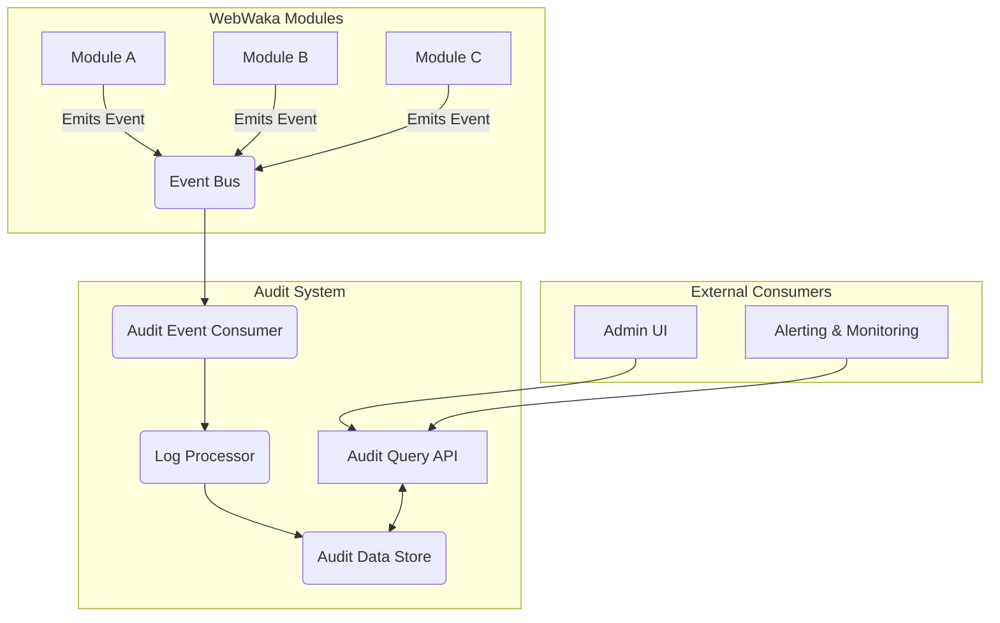

# Audit System Specification

**Module ID:** Module 9  
**Module Name:** Audit System  
**Version:** 1.0  
**Date:** 2026-02-10  
**Status:** DRAFT  
**Author:** webwakaagent3 (Architecture)  
**Reviewers:** webwakaagent4 (Engineering), webwakaagent5 (Quality)

---

## 1. Module Overview

### 1.1 Purpose

The Audit System is a foundational module of the WebWaka platform responsible for capturing, storing, and querying a comprehensive trail of all significant actions performed within the system. It provides a secure, immutable, and searchable log of events, ensuring accountability, compliance, and traceability across all modules and tenant activities.

### 1.2 Scope

**In Scope:**

-   Capturing and logging of all CRUD operations on all data entities.
-   Logging of all security-related events (e.g., login, logout, permission changes).
-   Logging of all administrative actions.
-   Storage of audit logs in a secure and immutable data store.
-   A query API for retrieving and filtering audit logs.
-   Tenant-level isolation of audit logs.

**Out of Scope:**

-   Real-time alerting or monitoring of audit events (this is the responsibility of a separate Monitoring module).
-   User-facing UI for viewing audit logs (this will be built by the relevant application modules).
-   Data analytics or business intelligence on audit data.

### 1.3 Success Criteria

-   [ ] All actions defined in the audit policy are logged successfully.
-   [ ] Audit logs are stored securely and cannot be tampered with.
-   [ ] The audit log query API provides flexible and efficient filtering capabilities.
-   [ ] The system meets the performance requirements for high-volume event logging.

---

## 2. Requirements

### 2.1 Functional Requirements

**FR-1: Comprehensive Event Logging**
- **Description:** The Audit System MUST log all significant events that occur within the platform. This includes all CRUD operations, security events, and administrative actions.
- **Priority:** MUST
- **Acceptance Criteria:**
  - [ ] All create, read, update, and delete operations on all data entities are logged.
  - [ ] All user login and logout events are logged.
  - [ ] All changes to user permissions are logged.
  - [ ] All administrative actions (e.g., creating a new tenant, changing system settings) are logged.

**FR-2: Data Integrity and Immutability**
- **Description:** Audit logs MUST be stored in a way that ensures their integrity and immutability. Once an audit log is written, it cannot be modified or deleted.
- **Priority:** MUST
- **Acceptance Criteria:**
  - [ ] Audit logs are stored in a write-once, read-many (WORM) compliant data store.
  - [ ] A cryptographic hash of each audit log is stored to detect any tampering.

**FR-3: Audit Log Query API**
- **Description:** The Audit System MUST provide a flexible and efficient API for querying audit logs.
- **Priority:** MUST
- **Acceptance Criteria:**
  - [ ] The API supports filtering by tenant ID, user ID, entity type, action type, and date range.
  - [ ] The API supports pagination for large result sets.
  - [ ] The API is secured and can only be accessed by authorized users.

**FR-4: Tenant-Level Isolation**
- **Description:** Audit logs MUST be strictly isolated by tenant. A user in one tenant should not be able to view the audit logs of another tenant.
- **Priority:** MUST
- **Acceptance Criteria:**
  - [ ] All audit logs are associated with a tenant ID.
  - [ ] The query API automatically filters audit logs by the tenant ID of the current user.

### 2.2 Non-Functional Requirements

**NFR-1: Performance**
- **Requirement:** The Audit System MUST be able to handle a high volume of events without impacting the performance of the platform.
- **Measurement:** Event ingestion rate and query response time.
- **Acceptance Criteria:**
  - [ ] The system can ingest at least 10,000 events per second.
  - [ ] The query API response time is less than 500ms for typical queries.

**NFR-2: Scalability**
- **Requirement:** The Audit System MUST be able to scale horizontally to handle a growing volume of data and traffic.
- **Measurement:** Number of events and data volume.
- **Acceptance Criteria:**
  - [ ] The system can store and query petabytes of audit data.
  - [ ] The system can be scaled by adding more nodes to the cluster.

**NFR-3: Reliability**
- **Requirement:** The Audit System MUST be highly reliable and not lose any audit data.
- **Measurement:** Data loss rate.
- **Acceptance Criteria:**
  - [ ] The data loss rate is less than 0.001%.
  - [ ] The system is designed for high availability with no single point of failure.

**NFR-4: Security**
- **Requirement:** The Audit System MUST be secure and protect audit data from unauthorized access.
- **Measurement:** Security vulnerabilities.
- **Acceptance Criteria:**
  - [ ] All audit data is encrypted at rest and in transit.
  - [ ] The system is protected against common security vulnerabilities (e.g., SQL injection, XSS).

---

## 3. Architecture

### 3.1 High-Level Architecture

The Audit System is designed with an event-driven, asynchronous architecture to ensure high throughput and minimal performance impact on the source modules. It decouples the process of generating audit events from the process of consuming and storing them.



**Components:**

1.  **Event Emitter (in source modules):** A standardized library or decorator used by all other modules to publish auditable events to the Event Bus.
2.  **Event Bus:** A central, high-throughput message broker (e.g., Kafka) that receives all audit events.
3.  **Audit Event Consumer:** A dedicated service that subscribes to the Event Bus, consuming the raw audit events in real-time.
4.  **Log Processor:** A service that enriches incoming events with additional context (e.g., IP address, user agent), validates the event schema, and formats it into a standardized audit log entry.
5.  **Audit Data Store:** A secure, immutable, and highly scalable data store optimized for write-heavy workloads and large-scale queries (e.g., Elasticsearch, ClickHouse, or a data lake solution like AWS S3 + Athena).
6.  **Audit Query API:** A secure REST API that provides authorized access to query the audit logs stored in the Audit Data Store.

**Data Flow:**

1.  A user or system process performs an action in a WebWaka module (e.g., `webwakaagent2` updates a product).
2.  The module's business logic uses the Event Emitter library to publish a structured audit event (e.g., `product.updated`) to a specific topic on the Event Bus.
3.  The Audit Event Consumer, subscribed to that topic, receives the event asynchronously.
4.  The event is passed to the Log Processor, which enriches it with metadata and transforms it into the canonical audit log format.
5.  The Log Processor securely writes the final, immutable log entry to the Audit Data Store.
6.  An administrator, using an Admin UI, requests to view recent activities. The UI calls the Audit Query API.
7.  The Audit Query API authenticates and authorizes the request, then queries the Audit Data Store with the specified filters, returning the relevant logs.

### 3.2 Component Details

#### Component 1: Audit Event Consumer

**Responsibility:** To reliably consume events from the Event Bus, ensuring no events are lost. It acts as the primary entry point to the Audit System.

**Interfaces:**
-   **Input:** A stream of audit events from the Event Bus.
-   **Output:** Raw audit events passed to the Log Processor.

**Dependencies:**
-   Event Bus

#### Component 2: Log Processor

**Responsibility:** To process, enrich, and standardize raw audit events before storage.

**Interfaces:**
-   **Input:** Raw audit events from the Audit Event Consumer.
-   **Output:** Enriched and formatted audit log entries sent to the Audit Data Store.

**Dependencies:**
-   User/Session Service (for context enrichment)
-   Geo-IP Service (for location enrichment)

#### Component 3: Audit Data Store

**Responsibility:** To provide a secure, immutable, and scalable long-term storage solution for all audit logs.

**Interfaces:**
-   **Input:** Formatted audit log entries from the Log Processor.
-   **Output:** Query results to the Audit Query API.

**Dependencies:**
-   None

#### Component 4: Audit Query API

**Responsibility:** To provide a secure and controlled access point for querying audit logs.

**Interfaces:**
-   **Input:** Authenticated REST API requests with query parameters.
-   **Output:** JSON-formatted audit log data.

**Dependencies:**
-   Audit Data Store
-   Permission System (for authorization)

### 3.3 Design Patterns

**Patterns Used:**

-   **Publish-Subscribe:** This pattern is fundamental to the architecture, decoupling event producers (WebWaka modules) from the Audit System. This ensures that modules can operate without being blocked by the logging process and that the Audit System can be scaled or modified independently.
-   **Asynchronous Processing:** By using an event bus, audit logging is performed asynchronously, which prevents any performance degradation in the user-facing modules.
-   **Data Transfer Object (DTO):** A standardized DTO will be used for all audit events to ensure consistency and a clear contract between modules and the Audit System.
-   **Immutable Data:** The core principle for the Audit Data Store is immutability. Once a log is written, it cannot be altered, which is critical for compliance and security.

---

## 4. API Specification

### 4.1 Event-Based API (Input)

The primary input to the Audit System is through events published on the central Event Bus. All modules MUST use a standardized event structure for auditable actions.

#### Event 1: `audit.action.performed`

**Event Type:** `audit.action.performed`  
**Description:** This is the canonical event published by any module when a significant, auditable action is performed.

**Payload:**
```json
{
  "eventType": "audit.action.performed",
  "eventId": "uuid-of-this-event",
  "timestamp": "2026-02-10T10:00:00.000Z",
  "sourceModule": "products-service",
  "tenantId": "tenant-uuid-123",
  "actor": {
    "userId": "user-uuid-456",
    "role": "admin",
    "ipAddress": "192.168.1.100",
    "userAgent": "Mozilla/5.0 ..."
  },
  "action": {
    "type": "UPDATE", // CREATE, UPDATE, DELETE, LOGIN, PERMISSION_CHANGE
    "entityType": "Product",
    "entityId": "product-uuid-789"
  },
  "details": {
    "originalState": { "price": 100 },
    "newState": { "price": 150 },
    "changes": [{"field": "price", "old": 100, "new": 150}]
  },
  "traceId": "trace-uuid-abc"
}
```

**Subscribers:** Audit Event Consumer

### 4.2 REST API Endpoints (Output)

The Audit System provides a RESTful API for querying the stored audit logs.

#### Endpoint 1: Query Audit Logs

**Method:** GET  
**Path:** `/api/v1/audit/logs`  
**Description:** Retrieves a paginated list of audit logs based on specified filter criteria.

**Query Parameters:**
-   `tenantId` (string, required): The ID of the tenant.
-   `userId` (string): Filter by the ID of the user who performed the action.
-   `entityType` (string): Filter by the type of entity (e.g., "Product", "User").
-   `entityId` (string): Filter by the specific ID of an entity.
-   `actionType` (string): Filter by the action type (e.g., "CREATE", "UPDATE").
-   `startDate` (ISO 8601 string): The start of the date range.
-   `endDate` (ISO 8601 string): The end of the date range.
-   `page` (integer, default: 1): The page number for pagination.
-   `limit` (integer, default: 100): The number of results per page.

**Response (Success):**
```json
{
  "status": "success",
  "data": {
    "logs": [
      {
        "logId": "log-uuid-xyz",
        "timestamp": "2026-02-10T10:00:00.000Z",
        "tenantId": "tenant-uuid-123",
        "actor": { "userId": "user-uuid-456", "role": "admin" },
        "action": { "type": "UPDATE", "entityType": "Product", "entityId": "product-uuid-789" },
        "details": { "changes": [{"field": "price", "old": 100, "new": 150}] }
      }
    ],
    "pagination": {
      "total": 1,
      "page": 1,
      "limit": 100
    }
  }
}
```

**Status Codes:**
- **200:** Success
- **400:** Bad Request (e.g., invalid filter parameters)
- **401:** Unauthorized
- **403:** Forbidden (user does not have permission to view audit logs)
- **500:** Internal Server Error

**Authentication:** Required  
**Authorization:** Requires `audit:read` permission.

---

## 5. Data Model

### 5.1 Entities

#### Entity 1: AuditLog

**Description:** Represents a single, immutable audit log entry.

**Attributes:**
- **logId:** UUID (Primary Key, Auto-generated)
- **timestamp:** Timestamp (Required, Indexed)
- **tenantId:** UUID (Required, Indexed)
- **actor:** JSON (Required) - Contains details about the user who performed the action (userId, role, ipAddress, userAgent).
- **action:** JSON (Required) - Contains details about the action performed (type, entityType, entityId).
- **details:** JSON (Optional) - Contains the specifics of the change (originalState, newState, changes).
- **traceId:** UUID (Indexed) - A unique ID to correlate related events.

**Relationships:**
- None (Audit logs are denormalized for performance and simplicity).

**Indexes:**
- **Primary:** logId
- **Composite Index:** (tenantId, timestamp) for efficient time-series queries within a tenant.
- **Secondary Indexes:** on `actor.userId`, `action.entityType`, `action.entityId`, `traceId`.

### 5.2 Database Schema

The exact schema will depend on the chosen data store. Below is a conceptual representation for a document-based store like Elasticsearch.

```json
{
  "mappings": {
    "properties": {
      "logId": { "type": "keyword" },
      "timestamp": { "type": "date" },
      "tenantId": { "type": "keyword" },
      "actor": {
        "properties": {
          "userId": { "type": "keyword" },
          "role": { "type": "keyword" },
          "ipAddress": { "type": "ip" },
          "userAgent": { "type": "text" }
        }
      },
      "action": {
        "properties": {
          "type": { "type": "keyword" },
          "entityType": { "type": "keyword" },
          "entityId": { "type": "keyword" }
        }
      },
      "details": { "type": "object", "enabled": false }, // Store as a raw JSON blob
      "traceId": { "type": "keyword" }
    }
  }
}
```

---

## 6. Dependencies

### 6.1 Internal Dependencies

**Depends On:**
- **Event Bus:** For receiving audit events from all other modules.
- **Permission System:** The Audit Query API depends on the Permission System to authorize access to audit logs.

**Depended On By:**
- **All Modules:** All other modules in the WebWaka platform will depend on the Audit System's client library (Event Emitter) to publish audit events.
- **Admin UI:** Will depend on the Audit Query API to display audit trails.
- **Alerting & Monitoring System:** Will depend on the Audit Query API to monitor for suspicious activities.

### 6.2 External Dependencies

**Third-Party Libraries:**
- **A message broker client library** (e.g., for Kafka, RabbitMQ) for the Audit Event Consumer.
- **A database client library** for the chosen Audit Data Store (e.g., Elasticsearch client, ClickHouse client).

**External Services:**
- **Event Bus / Message Broker** (e.g., Apache Kafka, RabbitMQ, AWS Kinesis).
- **Audit Data Store** (e.g., Elasticsearch, ClickHouse, AWS S3).

---

## 7. Compliance

### 7.1 Architectural Invariants

-   [x] **Offline-First:** The Audit System is designed to be resilient to network partitions. Modules will queue audit events locally if the Event Bus is unavailable.
-   [x] **Event-Driven:** The entire architecture is event-driven, with modules publishing events and the Audit System consuming them asynchronously.
-   [x] **Plugin-First:** The Audit System itself is a core module, but the event emission logic will be implemented as a pluggable library/decorator for other modules.
-   [x] **Multi-Tenant:** All audit logs are strictly scoped by `tenantId`.
-   [x] **Permission-Driven:** Access to audit logs is controlled by the Permission System.
-   [x] **API-First:** All functionality is exposed via a secure, versioned REST API.
-   [x] **Mobile-First & Africa-First:** The Audit System supports the overall platform goals by providing a robust and reliable audit trail, which is critical for building trust in the African market.
-   [x] **Audit-Ready:** This is the core purpose of the module.
-   [x] **Nigerian-First:** The system will be compliant with Nigerian data protection regulations (NDPR) by providing a clear audit trail of data access and modifications.
-   [x] **PWA-First:** Not directly applicable to this backend module, but it supports PWA applications by providing a reliable audit trail for their operations.

### 7.2 Nigerian-First Compliance

-   [x] **NDPR Compliant:** The Audit System is a key component for achieving NDPR compliance by providing a detailed record of all data processing activities.

### 7.3 Mobile-First Compliance

-   [x] **Low-Bandwidth Networks:** The asynchronous, event-driven architecture ensures that mobile clients are not blocked by audit logging operations.

### 7.4 PWA-First Compliance

-   [x] **Offline Functionality:** The Audit System supports offline functionality by allowing client-side modules to queue audit events locally when offline.

### 7.5 Africa-First Compliance

-   [x] **Trust and Transparency:** A robust audit trail is essential for building trust with users and businesses across Africa.

---

## 8. Testing Requirements

### 8.1 Unit Testing
**Coverage Target:** 100%

**Test Cases:**
- [ ] Test that the Log Processor correctly enriches and transforms events.
- [ ] Test that the Audit Query API correctly parses filter parameters.
- [ ] Test the tenant isolation logic in the query service.

### 8.2 Integration Testing
**Test Scenarios:**
- [ ] Test the end-to-end flow from event emission to storage in the Audit Data Store.
- [ ] Test the integration with the Permission System for query authorization.
- [ ] Test the system's behavior when the Event Bus is down (event queuing and recovery).

### 8.3 Performance Testing
**Performance Metrics:**
- [ ] Measure the event ingestion rate under high load.
- [ ] Measure the query response time for various filter combinations.
- [ ] Measure the performance impact on a source module when emitting a high volume of events.

### 8.4 Security Testing
**Security Tests:**
- [ ] Test for unauthorized access to the Audit Query API.
- [ ] Test for unauthorized access to audit logs of other tenants.
- [ ] Test for injection attacks on the query API.

---

## 9. Documentation Requirements

### 9.1 Module Documentation
- [ ] README.md (module overview, setup instructions)
- [ ] ARCHITECTURE.md (detailed architecture)
- [ ] API.md (API documentation)

### 9.2 API Documentation
- [ ] OpenAPI/Swagger specification for the Audit Query API.
- [ ] Detailed documentation for the `audit.action.performed` event schema.

### 9.3 User Documentation
- [ ] A guide for administrators on how to query and interpret audit logs.

---

## 10. Risks and Mitigation

### Risk 1: Event Loss
**Description:** Audit events could be lost if the Event Bus or the Audit Event Consumer fails.
**Probability:** Medium
**Impact:** High
**Mitigation:** Use a persistent, highly available Event Bus (like Kafka). The Audit Event Consumer will use acknowledgements to ensure that events are not lost if the consumer fails.

### Risk 2: Performance Bottleneck
**Description:** A high volume of audit events could overwhelm the system and impact performance.
**Probability:** Medium
**Impact:** Medium
**Mitigation:** The asynchronous architecture is designed to prevent this. The system will be load-tested to identify and address any bottlenecks. The Audit Data Store will be chosen for its write performance.

---

## 11. Timeline

**Specification:** Week 28
**Implementation:** Weeks 29-30
**Testing:** Week 30
**Validation:** Week 30
**Approval:** Week 30

---

## 12. Approval

**Architecture (webwakaagent3):**
- [x] Specification complete
- [x] All sections filled
- [x] Compliance validated
- [ ] Submitted for review

**Engineering (webwakaagent4):**
- [ ] Specification reviewed
- [ ] Feedback provided
- [ ] Approved for implementation

**Quality (webwakaagent5):**
- [ ] Test strategy defined
- [ ] Test cases identified
- [ ] Approved for implementation

**Founder Agent (webwaka007):**
- [ ] Final approval
- [ ] Ready for implementation
