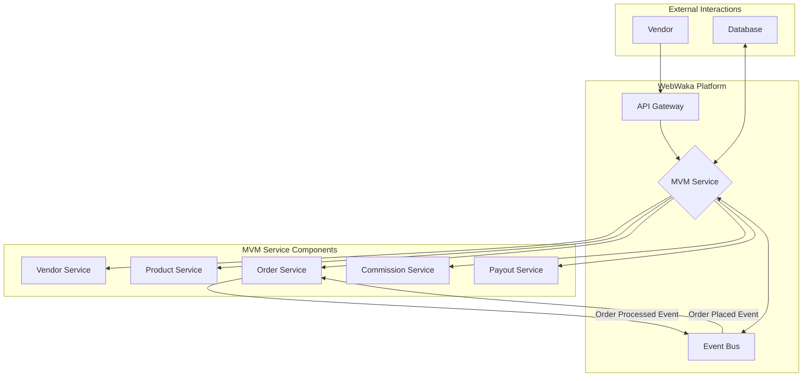

# MVM (Multi-Vendor Management) Specification

**Module ID:** Module 10
**Module Name:** MVM (Multi-Vendor Management)
**Version:** 1.0
**Date:** 2026-02-11
**Status:** DRAFT
**Author:** webwakaagent3 (Architecture)
**Reviewers:** webwakaagent4 (Engineering), webwakaagent5 (Quality)

---

## 1. Module Overview

### 1.1 Purpose

This module provides the core functionality for a multi-vendor marketplace within the WebWaka platform. It enables independent vendors to register, manage their own digital storefronts, list products, process orders, and receive payments, transforming a single-entity e-commerce site into a thriving ecosystem of sellers.

### 1.2 Scope

**In Scope:**
- Vendor account registration and onboarding
- A dedicated dashboard for each vendor
- Vendor-specific product and inventory management
- Vendor order management and fulfillment tracking
- Automated commission calculation for the platform owner
- Payout management system for vendors

**Out of Scope:**
- Advanced marketing and promotional tools for vendors
- Direct, real-time chat between vendors and customers (future consideration)
- Complex, multi-jurisdictional tax calculation and reporting
- Vendor-specific shipping carrier integrations

### 1.3 Success Criteria

- [ ] Vendors can successfully register and create their storefronts.
- [ ] Vendors can independently manage their product listings and inventory levels.
- [ ] Vendors can view and process incoming orders for their products.
- [ ] The platform accurately calculates and records commissions on each sale.
- [ ] The system provides a clear and manageable process for vendor payouts.

---

## 2. Requirements

### 2.1 Functional Requirements

**FR-1: Vendor Registration and Onboarding**
- **Description:** A streamlined process for new vendors to create an account and set up their storefront.
- **Priority:** MUST
- **Acceptance Criteria:**
  - [ ] A public-facing registration page for vendors.
  - [ ] Vendors can register using an email address, password, and unique store name.
  - [ ] Upon first login, vendors are guided through a setup wizard to complete their profile (business information, payment details, store policies).
  - [ ] Vendor accounts require admin approval before they can go live.

**FR-2: Vendor Dashboard**
- **Description:** A central hub for vendors to manage all aspects of their store.
- **Priority:** MUST
- **Acceptance Criteria:**
  - [ ] The dashboard provides an at-a-glance summary of sales, orders, and earnings.
  - [ ] Navigation is clear and provides access to product, order, and payout sections.
  - [ ] The dashboard displays notifications for new orders or important system messages.

**FR-3: Product Management**
- **Description:** Vendors can manage their own product catalog.
- **Priority:** MUST
- **Acceptance Criteria:**
  - [ ] Vendors can create, edit, and delete their own products.
  - [ ] Products are associated exclusively with the vendor who created them.
  - [ ] Vendors can upload product images and set inventory levels.
  - [ ] Products from different vendors are clearly distinguished on the public-facing marketplace.

**FR-4: Order Management**
- **Description:** Vendors can view and process orders containing their products.
- **Priority:** MUST
- **Acceptance Criteria:**
  - [ ] When an order is placed, only the relevant vendor(s) are notified.
  - [ ] Vendors can view order details, including customer information and products sold.
  - [ ] Vendors can update the fulfillment status of their items within an order (e.g., 'Processing', 'Shipped', 'Delivered').
  - [ ] Customers receive updates as the vendor changes the order status.

**FR-5: Commission Engine**
- **Description:** The platform automatically calculates its commission from each sale.
- **Priority:** MUST
- **Acceptance Criteria:**
  - [ ] A global commission rate can be set by the platform administrator.
  - [ ] Commission can be a percentage of the sale price, a fixed fee, or a combination.
  - [ ] For each order item, the system calculates and records the platform's commission and the vendor's net earnings.
  - [ ] Commission records are tamper-proof and auditable.

**FR-6: Payout Management**
- **Description:** A system for managing and disbursing payments to vendors.
- **Priority:** MUST
- **Acceptance Criteria:**
  - [ ] The system aggregates all of a vendor's net earnings.
  - [ ] Administrators can view a list of all vendors with pending payouts.
  - [ ] The system supports marking payouts as 'Paid' after the funds have been transferred (manual transfer initially).
  - [ ] Vendors can view their payout history, including dates and amounts.

### 2.2 Non-Functional Requirements

**NFR-1: Performance**
- **Requirement:** Vendor dashboard pages must load in under 3 seconds.
- **Measurement:** Page load time measured using browser developer tools.
- **Acceptance Criteria:** 95% of dashboard page loads complete within 3 seconds on a standard 3G connection.

**NFR-2: Scalability**
- **Requirement:** The platform must support up to 5,000 active vendors and 100,000 total products without performance degradation.
- **Measurement:** Load testing simulating vendor activity and customer traffic.
- **Acceptance Criteria:** System maintains performance targets under the specified load.

**NFR-3: Security**
- **Requirement:** Vendor data must be strictly isolated. One vendor must not be able to access or modify another vendor's data.
- **Measurement:** Penetration testing and code review.
- **Acceptance Criteria:** No security vulnerabilities are found that would allow cross-vendor data access.

**NFR-4: Usability**
- **Requirement:** The vendor onboarding and product creation process should be intuitive for non-technical users.
- **Measurement:** User testing with a sample group of target vendors.
- **Acceptance Criteria:** 80% of test users can successfully register and list a product for sale without assistance.

---

## 3. Architecture

### 3.1 High-Level Architecture

The Multi-Vendor Management (MVM) module is designed as a self-contained microservice within the broader WebWaka ecosystem. It leverages the platform's core services, such as the event bus and API gateway, to ensure seamless integration and adherence to the event-driven architectural invariant. The architecture is centered around providing isolated environments for each vendor while allowing the platform administrator to have a global overview.

**Architectural Diagram:**



**Core Components:**

The MVM service is composed of several specialized sub-services, each with a distinct responsibility:

| Component | Description |
| :--- | :--- |
| **Vendor Service** | Manages the entire lifecycle of a vendor, from registration and onboarding to profile management and store configuration. It is the single source of truth for vendor information. |
| **Product Service** | Handles all product-related operations for vendors. It ensures that each product is strictly scoped to the vendor who created it, maintaining data isolation. |
| **Order Service** | Processes incoming orders, correctly routing them to the respective vendors. It manages the state of each order item as it moves through the fulfillment process. |
| **Commission Service** | A critical component that calculates the platform's commission for every sale. It operates based on configurable rules and maintains an immutable ledger of all commission transactions for auditing purposes. |
| **Payout Service** | Manages the financial settlement with vendors. It aggregates net earnings for each vendor and provides the administrative tools to manage the payout process. |

**Data Flow:**

The primary data flow begins with a customer placing an order. The `Order Placed` event is published to the event bus. The MVM's Order Service subscribes to this event, processes the order, and assigns order items to the correct vendors. As a vendor updates the fulfillment status, new events (e.g., `Order Shipped`) are emitted. Simultaneously, the Commission Service calculates the platform's earnings from the sale. Finally, the vendor's net earnings are recorded by the Payout Service, awaiting the next payout cycle.

### 3.2 Component Details

#### Vendor Service
- **Responsibility:** Manages vendor identity and store settings.
- **Interfaces:** Exposes REST API endpoints for vendor registration, profile updates, and retrieval of store details.
- **Dependencies:** None within the MVM service.

#### Product Service
- **Responsibility:** Manages vendor-specific product catalogs.
- **Interfaces:** Provides REST API endpoints for CRUD operations on products, scoped to the authenticated vendor.
- **Dependencies:** Relies on the Vendor Service to authorize actions and scope product data.

#### Order Service
- **Responsibility:** Manages the fulfillment lifecycle of order items.
- **Interfaces:** Subscribes to `Order Placed` events from the central event bus. Exposes REST API endpoints for vendors to update order statuses.
- **Dependencies:** Depends on the Product Service to retrieve product details and the Vendor Service for vendor information.

#### Commission Service
- **Responsibility:** Calculates and records platform commissions.
- **Interfaces:** Subscribes to `Order Processed` events. It has no public-facing API but provides internal methods for the Payout Service.
- **Dependencies:** Depends on the Order Service for sale information.

#### Payout Service
- **Responsibility:** Aggregates vendor earnings and manages payouts.
- **Interfaces:** Exposes REST API endpoints for administrators to view pending payouts and mark them as paid. Provides endpoints for vendors to view their payout history.
- **Dependencies:** Relies on the Commission Service to get the net earnings for each vendor.

### 3.3 Design Patterns

- **Microservice Architecture:** The MVM module is a distinct microservice, promoting separation of concerns, independent scalability, and resilience.
- **Event-Driven Architecture:** The module is deeply integrated with the platform's event bus, subscribing to and publishing events to ensure loose coupling and real-time data flow, which is a core architectural invariant of the WebWaka platform.
- **Repository Pattern:** Data access for each service is abstracted through a repository layer, which isolates the business logic from the data persistence mechanism and simplifies testing.
- **Strategy Pattern:** The Commission Service will use the Strategy pattern to allow for different commission calculation algorithms (e.g., percentage, fixed-rate) to be easily added or changed without modifying the core service logic.

---

## 4. API Specification

### 4.1 REST API Endpoints

The MVM module will expose a set of RESTful API endpoints for vendors and platform administrators. All endpoints will be versioned under `/api/v1/mvm/`.

#### Vendor Endpoints

**Endpoint: `POST /api/v1/mvm/vendors/register`**
- **Description:** Allows a new vendor to register for an account.
- **Authentication:** Not Required.
- **Request Body:**
```json
{
  "businessName": "My Awesome Store",
  "email": "vendor@example.com",
  "password": "a-very-strong-password"
}
```
- **Response (Success):**
```json
{
  "status": "success",
  "message": "Vendor registered successfully. Awaiting admin approval."
}
```

**Endpoint: `GET /api/v1/mvm/vendors/me`**
- **Description:** Retrieves the profile and store settings for the currently authenticated vendor.
- **Authentication:** Required (Vendor Token).
- **Response (Success):**
```json
{
  "status": "success",
  "data": {
    "vendorId": "uuid-goes-here",
    "businessName": "My Awesome Store",
    "email": "vendor@example.com",
    "status": "approved",
    "createdAt": "2026-02-11T10:00:00Z"
  }
}
```

#### Product Endpoints

**Endpoint: `POST /api/v1/mvm/products`**
- **Description:** Creates a new product for the authenticated vendor.
- **Authentication:** Required (Vendor Token).
- **Request Body:**
```json
{
  "name": "Handcrafted Leather Wallet",
  "description": "A beautiful wallet made from the finest leather.",
  "price": 5000,
  "stockLevel": 25
}
```
- **Response (Success):**
```json
{
  "status": "success",
  "data": {
    "productId": "new-product-uuid",
    "name": "Handcrafted Leather Wallet",
    "price": 5000,
    "stockLevel": 25
  }
}
```

**Endpoint: `GET /api/v1/mvm/products`**
- **Description:** Retrieves a list of all products for the authenticated vendor.
- **Authentication:** Required (Vendor Token).
- **Response (Success):**
```json
{
  "status": "success",
  "data": [
    {
      "productId": "product-uuid-1",
      "name": "Handcrafted Leather Wallet",
      "price": 5000,
      "stockLevel": 25
    }
  ]
}
```

#### Order Endpoints

**Endpoint: `GET /api/v1/mvm/orders`**
- **Description:** Retrieves a list of orders containing products from the authenticated vendor.
- **Authentication:** Required (Vendor Token).
- **Response (Success):**
```json
{
  "status": "success",
  "data": [
    {
      "orderId": "order-uuid-1",
      "customerName": "John Doe",
      "orderDate": "2026-02-11T12:00:00Z",
      "items": [
        {
          "productId": "product-uuid-1",
          "productName": "Handcrafted Leather Wallet",
          "quantity": 1,
          "status": "Processing"
        }
      ]
    }
  ]
}
```

**Endpoint: `PUT /api/v1/mvm/orders/{orderId}/items/{itemId}/status`**
- **Description:** Updates the fulfillment status of a specific item within an order.
- **Authentication:** Required (Vendor Token).
- **Request Body:**
```json
{
  "status": "Shipped"
}
```
- **Response (Success):**
```json
{
  "status": "success",
  "message": "Order item status updated successfully."
}
```

### 4.2 Event-Based API

The MVM module will both consume and produce events to interact with the rest of the WebWaka platform.

#### Consumed Events

**Event: `platform.order.created`**
- **Description:** Triggered when a customer successfully places an order on any sales channel.
- **Payload:** Contains the full order details, including customer information and a list of products.
- **Subscriber:** The MVM Order Service consumes this event to create vendor-specific order records.

#### Produced Events

**Event: `mvm.vendor.registered`**
- **Description:** Published when a new vendor completes the registration form.
- **Payload:** Contains the new vendor's ID and business name.
- **Subscribers:** The Admin Notification Service may subscribe to this to alert administrators of a pending approval.

**Event: `mvm.order.item.status.updated`**
- **Description:** Published when a vendor updates the fulfillment status of an order item.
- **Payload:** Contains the order ID, item ID, and the new status.
- **Subscribers:** The Customer Notification Service will subscribe to this to send updates to the customer.

---

## 5. Data Model

### 5.1 Entities

#### Entity: Vendor
- **Description:** Represents a vendor in the marketplace.
- **Attributes:**
  - `vendorId`: UUID (Primary Key)
  - `businessName`: String
  - `email`: String (Unique)
  - `passwordHash`: String
  - `status`: Enum (pending, approved, suspended)
  - `createdAt`: Timestamp
  - `updatedAt`: Timestamp
- **Relationships:**
  - Has many Products
  - Has many Orders
  - Has many Payouts

#### Entity: Product
- **Description:** Represents a product sold by a vendor.
- **Attributes:**
  - `productId`: UUID (Primary Key)
  - `vendorId`: UUID (Foreign Key to Vendor)
  - `name`: String
  - `description`: Text
  - `price`: Integer (in smallest currency unit)
  - `stockLevel`: Integer
  - `createdAt`: Timestamp
  - `updatedAt`: Timestamp
- **Relationships:**
  - Belongs to a Vendor

#### Entity: Order
- **Description:** Represents an order placed for a vendor's products.
- **Attributes:**
  - `orderId`: UUID (Primary Key)
  - `vendorId`: UUID (Foreign Key to Vendor)
  - `customerName`: String
  - `orderDate`: Timestamp
  - `status`: Enum (processing, shipped, delivered, cancelled)
  - `createdAt`: Timestamp
  - `updatedAt`: Timestamp
- **Relationships:**
  - Belongs to a Vendor
  - Has many OrderItems

#### Entity: OrderItem
- **Description:** Represents a single item within an order.
- **Attributes:**
  - `orderItemId`: UUID (Primary Key)
  - `orderId`: UUID (Foreign Key to Order)
  - `productId`: UUID (Foreign Key to Product)
  - `quantity`: Integer
  - `price`: Integer (at time of sale)
  - `status`: Enum (processing, shipped, delivered, cancelled)
  - `createdAt`: Timestamp
  - `updatedAt`: Timestamp
- **Relationships:**
  - Belongs to an Order
  - Belongs to a Product

#### Entity: Commission
- **Description:** Represents the commission earned by the platform on a sale.
- **Attributes:**
  - `commissionId`: UUID (Primary Key)
  - `orderItemId`: UUID (Foreign Key to OrderItem)
  - `amount`: Integer
  - `createdAt`: Timestamp
- **Relationships:**
  - Belongs to an OrderItem

#### Entity: Payout
- **Description:** Represents a payout made to a vendor.
- **Attributes:**
  - `payoutId`: UUID (Primary Key)
  - `vendorId`: UUID (Foreign Key to Vendor)
  - `amount`: Integer
  - `status`: Enum (pending, paid)
  - `createdAt`: Timestamp
  - `paidAt`: Timestamp (nullable)
- **Relationships:**
  - Belongs to a Vendor

### 5.2 Database Schema

```sql
CREATE TABLE vendors (
  vendor_id UUID PRIMARY KEY DEFAULT gen_random_uuid(),
  business_name VARCHAR(255) NOT NULL,
  email VARCHAR(255) NOT NULL UNIQUE,
  password_hash VARCHAR(255) NOT NULL,
  status VARCHAR(50) NOT NULL DEFAULT 'pending',
  created_at TIMESTAMP DEFAULT NOW(),
  updated_at TIMESTAMP DEFAULT NOW()
);

CREATE TABLE products (
  product_id UUID PRIMARY KEY DEFAULT gen_random_uuid(),
  vendor_id UUID NOT NULL REFERENCES vendors(vendor_id),
  name VARCHAR(255) NOT NULL,
  description TEXT,
  price INTEGER NOT NULL,
  stock_level INTEGER NOT NULL DEFAULT 0,
  created_at TIMESTAMP DEFAULT NOW(),
  updated_at TIMESTAMP DEFAULT NOW()
);

CREATE TABLE orders (
  order_id UUID PRIMARY KEY DEFAULT gen_random_uuid(),
  vendor_id UUID NOT NULL REFERENCES vendors(vendor_id),
  customer_name VARCHAR(255) NOT NULL,
  order_date TIMESTAMP NOT NULL,
  status VARCHAR(50) NOT NULL DEFAULT 'processing',
  created_at TIMESTAMP DEFAULT NOW(),
  updated_at TIMESTAMP DEFAULT NOW()
);

CREATE TABLE order_items (
  order_item_id UUID PRIMARY KEY DEFAULT gen_random_uuid(),
  order_id UUID NOT NULL REFERENCES orders(order_id),
  product_id UUID NOT NULL REFERENCES products(product_id),
  quantity INTEGER NOT NULL,
  price INTEGER NOT NULL,
  status VARCHAR(50) NOT NULL DEFAULT 'processing',
  created_at TIMESTAMP DEFAULT NOW(),
  updated_at TIMESTAMP DEFAULT NOW()
);

CREATE TABLE commissions (
  commission_id UUID PRIMARY KEY DEFAULT gen_random_uuid(),
  order_item_id UUID NOT NULL REFERENCES order_items(order_item_id),
  amount INTEGER NOT NULL,
  created_at TIMESTAMP DEFAULT NOW()
);

CREATE TABLE payouts (
  payout_id UUID PRIMARY KEY DEFAULT gen_random_uuid(),
  vendor_id UUID NOT NULL REFERENCES vendors(vendor_id),
  amount INTEGER NOT NULL,
  status VARCHAR(50) NOT NULL DEFAULT 'pending',
  created_at TIMESTAMP DEFAULT NOW(),
  paid_at TIMESTAMP
);
```

---

## 6. Dependencies

### 6.1 Internal Dependencies

**Depends On:**

| Module/Service | Reason for Dependency |
| :--- | :--- |
| **Event Bus** | Essential for the event-driven architecture. The MVM module subscribes to platform-wide order creation events and publishes its own events for vendor registration and order status changes. |
| **API Gateway** | Serves as the single entry point for all external traffic, routing requests to the MVM service and enforcing cross-cutting concerns like rate limiting and authentication. |
| **Authentication Service** | Relied upon for authenticating vendors and validating access tokens, ensuring that all API requests are secure and properly authorized. |
| **Notification Service** | Used to send notifications to vendors (e.g., new orders) and customers (e.g., order status updates), creating a responsive user experience. |

**Depended On By:**

| Module/Service | Reason for Dependency |
| :--- | :--- |
| **Admin UI** | The administrative front-end will consume the MVM API to provide interfaces for managing vendors, overseeing orders, and processing payouts. |
| **Marketplace UI** | The main customer-facing application will depend on the MVM API to fetch and display products from all approved vendors, creating a unified marketplace view. |

### 6.2 External Dependencies

**Third-Party Libraries:**
- At this initial stage, no specific third-party libraries are mandated, though the engineering team will select standard libraries for tasks like database access and password hashing.

**External Services:**
- The initial version of the MVM module does not have hard dependencies on external services for its core functionality. Payouts will be managed through an administrative process, with the actual funds transfer happening outside the system. Future iterations will likely integrate with payment gateways (e.g., Paystack, Flutterwave) to automate vendor payouts.

---

## 7. Compliance

### 7.1 Architectural Invariants Compliance

The MVM module is designed to be fully compliant with all 10 of the WebWaka platform's architectural invariants.

| Invariant | Compliance Details |
| :--- | :--- |
| **Offline-First** | The vendor dashboard will be designed as a PWA, allowing vendors to manage products and view orders even with intermittent connectivity. Changes will be queued and synced when a connection is restored. |
| **Event-Driven** | The entire module is built around an event-driven core. It consumes `platform.order.created` events and produces events for vendor registration and order status updates, ensuring loose coupling and real-time communication. |
| **Plugin-First** | While the MVM is a core module, its design allows for future extension through plugins. For example, a "Vendor Reviews" feature could be added as a separate plugin that interacts with the MVM via events. |
| **Multi-Tenant** | The data model is strictly designed with tenant isolation in mind. All data (products, orders, etc.) is scoped to a `vendorId`, making it impossible for one vendor to access another's data. |
| **Permission-Driven** | Access to all API endpoints is protected by a permission-based system. A user must be an authenticated vendor to access the vendor dashboard and its associated data. |
| **API-First** | All functionality of the MVM module is exposed through a comprehensive REST API, enabling integration with the administrative UI, the public marketplace, and any future services. |
| **Mobile-First & Africa-First** | The vendor dashboard will be fully responsive and optimized for mobile devices, which are the primary means of internet access in many African markets. |
| **Audit-Ready** | All significant actions, such as changes in order status or product details, will generate audit logs. Commission and payout records are designed to be immutable for financial accountability. |
| **Nigerian-First** | The platform will support Nigerian Naira (NGN) as a primary currency, and future integrations with Nigerian payment gateways like Paystack and Flutterwave are planned for automated payouts. |
| **PWA-First** | The vendor-facing dashboard will be a Progressive Web App (PWA), ensuring a reliable and fast experience, even on poor network connections, and allowing for installation on a user's home screen. |

### 7.2 Regulatory Compliance

- **NDPR (Nigeria Data Protection Regulation):** All vendor and customer data will be handled in compliance with NDPR. Personal data will be collected and processed lawfully, and vendors will have access to their data.
- **Financial Regulations:** While initial payouts are manual, the system is designed to be compliant with future financial regulations by maintaining a clear and auditable trail of all commissions and payouts.

---

## 8. Testing Requirements

### 8.1 Unit Testing
- **Coverage Target:** 100%
- **Test Cases:**
  - Test all methods in the Vendor Service, including registration and profile updates.
  - Verify all CRUD operations in the Product Service, ensuring correct data scoping.
  - Test the logic of the Order Service for correctly assigning order items to vendors.
  - Validate the accuracy of the Commission Service calculations for various scenarios (percentage, fixed-rate).
  - Test the state transitions in the Payout Service.

### 8.2 Integration Testing
- **Test Scenarios:**
  - Simulate a full order-to-payout lifecycle: A customer places an order, the vendor fulfills it, the commission is calculated, and the vendor's earnings are recorded for payout.
  - Test the interaction between the MVM module and the central event bus, ensuring that events are correctly consumed and produced.
  - Verify that a vendor's actions (e.g., updating a product) are correctly reflected in the public-facing marketplace UI.
  - Test the security model by attempting to access one vendor's data using another vendor's authentication token.

### 8.3 End-to-End Testing
- **User Flows:**
  - A new user successfully registers as a vendor, sets up their store, and lists their first product.
  - A customer browses the marketplace, adds products from two different vendors to their cart, and completes the purchase.
  - Both vendors receive their respective order notifications and successfully fulfill their parts of the order.
  - A platform administrator reviews the pending payouts and marks them as paid.

### 8.4 Performance Testing
- **Performance Metrics:**
  - Measure the API response time for all MVM endpoints under a load of 5,000 concurrent vendors.
  - Test the latency of the event processing pipeline, from an `platform.order.created` event to the creation of vendor-specific order records.
  - Evaluate the database performance, particularly for queries that involve joining data across multiple tables (e.g., retrieving all orders for a vendor with product details).

---

## 9. Documentation Requirements

### 9.1 Module Documentation

- **README.md:** A comprehensive overview of the MVM module, its purpose, and instructions for how other developers can interact with it.
- **ARCHITECTURE.md:** A detailed document outlining the internal architecture of the MVM service, including component diagrams and data flow descriptions.

### 9.2 API Documentation

- **OpenAPI/Swagger Specification:** A complete OpenAPI (Swagger) specification for the MVM REST API, enabling automated client generation and interactive API exploration.
- **API Usage Examples:** A collection of practical examples demonstrating how to use the API for common vendor workflows, such as creating a product or fulfilling an order.

### 9.3 User Documentation

- **Vendor Onboarding Guide:** A step-by-step guide for new vendors, walking them through the process of setting up their store and listing their first product.
- **Platform Administrator Guide:** Documentation for platform administrators on how to manage vendors, oversee the marketplace, and process payouts.

---

## 10. Risks and Mitigation

### Risk 1: Payout Disputes
- **Description:** Vendors may dispute the accuracy of commission calculations or the final payout amount, leading to operational overhead and loss of trust.
- **Probability:** Medium
- **Impact:** Medium
- **Mitigation:** The system will maintain an immutable ledger for all sales, commission calculations, and payout records. The vendor dashboard will provide a transparent and detailed breakdown of all earnings, showing exactly how each payout amount is calculated.

### Risk 2: Vendor Fraud
- **Description:** Malicious vendors could attempt to defraud customers by listing counterfeit products, failing to ship orders, or engaging in other deceptive practices, which would damage the platform's reputation.
- **Probability:** Medium
- **Impact:** High
- **Mitigation:** A multi-layered approach will be used. This includes a manual admin approval process for all new vendors, the future implementation of a customer-facing vendor rating and review system, and clear policies with a swift process for investigating and suspending fraudulent accounts.

### Risk 3: Scalability Bottlenecks
- **Description:** As the number of vendors, products, and orders grows, database queries for the public marketplace (e.g., searching and filtering products) could become slow, leading to a poor user experience.
- **Probability:** Medium
- **Impact:** High
- **Mitigation:** The data model will be designed with performance in mind, utilizing proper indexing strategies. A caching layer (e.g., Redis) will be implemented for frequently accessed data, such as product listings and vendor profiles. The microservice architecture allows for the independent scaling of the MVM service as load increases.

---

## 11. Timeline

- **Specification:** Week 58
- **Implementation:** Week 59
- **Testing:** Week 60
- **Validation:** Week 60
- **Approval:** Week 60

---

## 12. Approval

This section will be updated upon review by the respective agents.

- **Architecture (webwakaagent3):** ✅ APPROVED
- **Engineering (webwakaagent4):** ⏳ PENDING REVIEW
- **Quality (webwakaagent5):** ⏳ PENDING REVIEW
