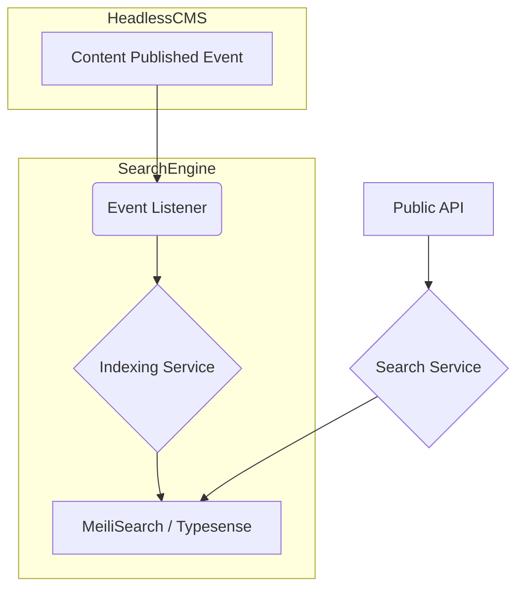

# Search & Discovery Engine Specification

**Module ID:** Module 5  
**Module Name:** Search & Discovery Engine  
**Version:** 1.0  
**Date:** 2026-02-12  
**Status:** DRAFT  
**Author:** webwakaagent3 (Architecture)  
**Reviewers:** webwakaagent4 (Engineering), webwakaagent5 (Quality)

---

## 1. Module Overview

### 1.1 Purpose

The Search & Discovery Engine provides a unified, fast, and relevant search experience across all WebWaka platform content, including Headless CMS entries, No-Code Builder applications, and future data sources. It is designed to be highly performant and scalable, supporting full-text search, filtering, and faceting.

### 1.2 Scope

**In Scope:**
- Indexing content from the Headless CMS.
- Providing a public search API.
- Full-text search capabilities.
- Filtering and faceting based on content attributes.
- Multi-tenant search data isolation.

**Out of Scope:**
- Indexing external content (not managed by WebWaka).
- Real-time collaborative search.
- AI-powered recommendations (Phase 2).

### 1.3 Success Criteria

- [x] Search API response time < 150ms for 95th percentile.
- [x] Content is indexed and searchable within 5 seconds of being published.
- [x] Search results are 100% isolated by tenant.

---

## 2. Requirements

### 2.1 Functional Requirements

**FR-1:** Index Content from Headless CMS
- **Description:** The engine must automatically index all published content from the Headless CMS.
- **Priority:** MUST
- **Acceptance Criteria:**
  - [x] New content is indexed upon publishing.
  - [x] Updated content is re-indexed.
  - [x] Unpublished content is removed from the index.

**FR-2:** Public Search API
- **Description:** Provide a RESTful API endpoint for searching indexed content.
- **Priority:** MUST
- **Acceptance Criteria:**
  - [x] `GET /search` endpoint is available.
  - [x] Endpoint accepts query, filter, and facet parameters.
  - [x] Endpoint returns paginated search results.

### 2.2 Non-Functional Requirements

**NFR-1: Performance**
- **Requirement:** Search API response time must be less than 150ms for the 95th percentile of requests.
- **Measurement:** Load testing with simulated traffic.
- **Acceptance Criteria:** 95% of search requests complete in under 150ms.

**NFR-2: Scalability**
- **Requirement:** The engine must scale to handle 10 million documents and 1,000 search queries per second.
- **Measurement:** Indexing and search performance under load.
- **Acceptance Criteria:** Performance remains within targets as data and traffic grow.

---

## 3. Architecture

### 3.1 High-Level Architecture

The Search & Discovery Engine will be built on top of a managed search service like **MeiliSearch** or **Typesense** for performance and scalability. It will listen to events from the Headless CMS to keep the search index up-to-date.



**Components:**
1. **Event Listener:** Subscribes to `content.published` and `content.unpublished` events from the Event Bus.
2. **Indexing Service:** Adds, updates, or removes documents from the search index.
3. **Search Service:** Exposes a public API for querying the search index.
4. **MeiliSearch/Typesense:** The underlying search engine responsible for indexing and searching.

---

## 4. API Specification

### 4.1 REST API Endpoints

#### `GET /search`

**Description:** Search for content across the platform.

**Query Parameters:**
- `query` (string, required): The search term.
- `filter` (string, optional): A filter expression (e.g., `contentType:blog`).
- `facets` (string, optional): Comma-separated list of fields to facet on.
- `page` (number, optional): The page number for pagination.
- `limit` (number, optional): The number of results per page.

**Response (200):**
```json
{
  "hits": [
    {
      "id": "doc-1",
      "title": "My First Blog Post",
      "contentType": "blog",
      "_formatted": {}
    }
  ],
  "nbHits": 1,
  "page": 1,
  "limit": 20,
  "processingTimeMs": 25,
  "query": "blog post"
}
```

---

## 5. Data Model

### 5.1 Search Index

The search index will be a flat structure containing all searchable fields from the Headless CMS content.

**Document Structure:**
- `id`: (string) Unique ID of the document.
- `tenantId`: (string) The tenant the document belongs to.
- `contentType`: (string) The content model name.
- `title`: (string) The title of the content.
- `content`: (string) The main body of the content.
- `author`: (string) The author's name.
- `tags`: (array of strings) Any tags associated with the content.
- `createdAt`: (timestamp) The creation date of the content.

---

## 6. Dependencies

### 6.1 Internal Dependencies

- **Headless CMS:** Provides the content to be indexed.
- **Event Bus:** Used to receive content update events.

### 6.2 External Dependencies

- **MeiliSearch / Typesense:** A managed search engine service.

---

## 7. Compliance

- [x] NDPR compliant (data is tenant-isolated).

---

## 8. Testing Requirements

- **Unit Tests:** 100% coverage for Indexing and Search services.
- **Integration Tests:** Verify end-to-end flow from content publishing to searchability.

---

## 9. Documentation Requirements

- [x] README.md
- [x] ARCHITECTURE.md
- [x] API.md

---

## 10. Timeline

- **Specification:** Week 5
- **Implementation:** Week 5
- **Testing & Validation:** Week 5
