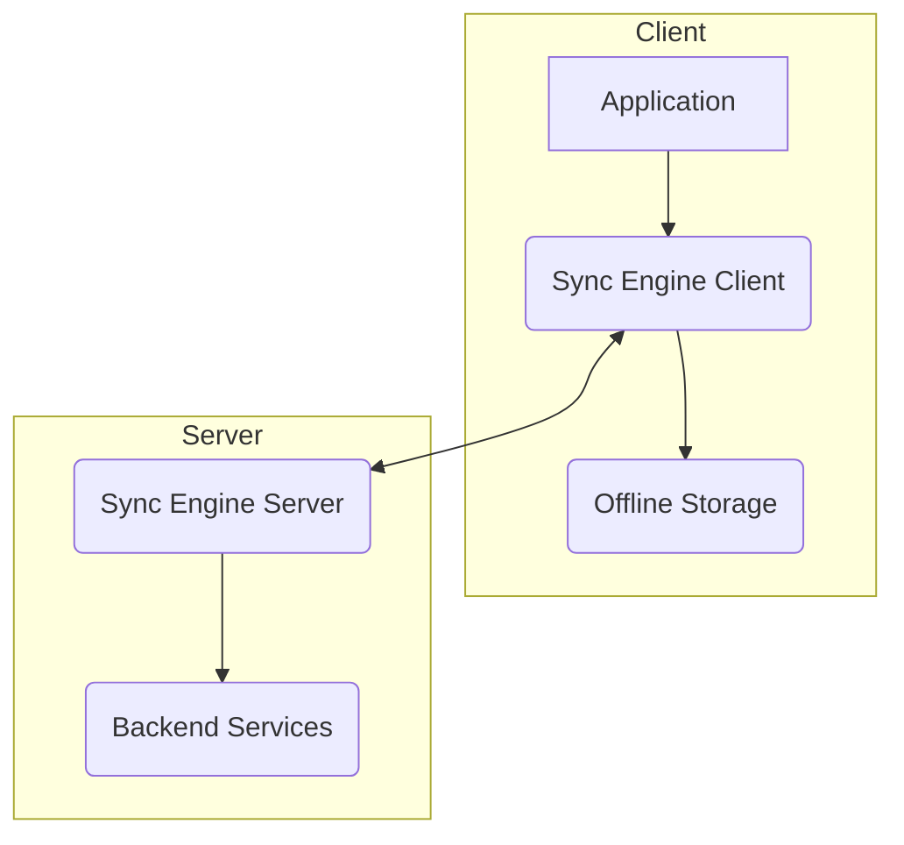

# Offline-First Sync Engine Specification

**Module ID:** Module 8  
**Module Name:** Offline-First Sync Engine  
**Version:** 1.0  
**Date:** 2026-02-16  
**Status:** DRAFT  
**Author:** webwakaagent3 (Architecture)  
**Reviewers:** webwakaagent4 (Engineering), webwakaagent5 (Quality)

---

## 1. Module Overview

### 1.1 Purpose

The Offline-First Sync Engine is a core module of the WebWaka platform responsible for synchronizing data between the client-side (browser, PWA) and the backend services. It ensures that the platform remains fully functional in low-connectivity environments, a critical requirement for the African market.

### 1.2 Scope

**In Scope:**

-   Client-side database for offline storage (IndexedDB)
-   Two-way data synchronization (client-to-server and server-to-client)
-   Conflict resolution strategies (last-write-wins, CRDTs)
-   Delta synchronization to minimize data transfer
-   Real-time updates using WebSockets
-   Queueing of offline mutations
-   Background synchronization using Service Workers

**Out of Scope:**

-   Application-specific business logic
-   User interface for displaying synchronized data
-   Server-side business logic for processing mutations

### 1.3 Success Criteria

-   [ ] All data is synchronized correctly between client and server.
-   [ ] The application remains functional when offline.
-   [ ] Data conflicts are resolved automatically.
-   [ ] Data transfer is minimized through delta synchronization.
-   [ ] Real-time updates are delivered to the client.


## 2. Requirements

### 2.1 Functional Requirements

**FR-1: Offline Data Storage**
- **Description:** The Sync Engine MUST use a client-side database to store data offline.
- **Priority:** MUST
- **Acceptance Criteria:**
  - [ ] Data is stored in IndexedDB.
  - [ ] Data is encrypted at rest on the client.

**FR-2: Two-Way Data Synchronization**
- **Description:** The Sync Engine MUST support two-way data synchronization between the client and server.
- **Priority:** MUST
- **Acceptance Criteria:**
  - [ ] Changes made on the client are synchronized to the server.
  - [ ] Changes made on the server are synchronized to the client.

**FR-3: Conflict Resolution**
- **Description:** The Sync Engine MUST provide a mechanism for resolving data conflicts.
- **Priority:** MUST
- **Acceptance Criteria:**
  - [ ] A default conflict resolution strategy (e.g., last-write-wins) is provided.
  - [ ] Custom conflict resolution strategies can be implemented.

**FR-4: Delta Synchronization**
- **Description:** The Sync Engine MUST use delta synchronization to minimize data transfer.
- **Priority:** SHOULD
- **Acceptance Criteria:**
  - [ ] Only the changes (deltas) are transferred between the client and server.

**FR-5: Real-Time Updates**
- **Description:** The Sync Engine MUST provide real-time updates to the client.
- **Priority:** SHOULD
- **Acceptance Criteria:**
  - [ ] WebSockets are used for real-time communication.
  - [ ] The client is updated in real-time when data changes on the server.

### 2.2 Non-Functional Requirements

**NFR-1: Performance**
- **Requirement:** The Sync Engine MUST have a low impact on application performance.
- **Measurement:** CPU and memory usage.
- **Acceptance Criteria:**
  - [ ] CPU usage < 10% on a low-spec device.
  - [ ] Memory usage < 50MB on a low-spec device.

**NFR-2: Scalability**
- **Requirement:** The Sync Engine MUST be able to handle a large number of concurrent users and a large volume of data.
- **Measurement:** Number of concurrent users and data volume.
- **Acceptance Criteria:**
  - [ ] Supports 10,000 concurrent users.
  - [ ] Supports 1GB of data per user.

**NFR-3: Reliability**
- **Requirement:** The Sync Engine MUST be reliable and not lose data.
- **Measurement:** Data loss rate.
- **Acceptance Criteria:**
  - [ ] Data loss rate < 0.01%.

**NFR-4: Security**
- **Requirement:** The Sync Engine MUST be secure and protect data from unauthorized access.
- **Measurement:** Security vulnerabilities.
- **Acceptance Criteria:**
  - [ ] All data is encrypted in transit and at rest.
  - [ ] The Sync Engine is protected against common security vulnerabilities (e.g., XSS, CSRF).

## 3. Architecture

### 3.1 High-Level Architecture



**Components:**

1.  **Sync Engine Client:** A client-side library that integrates with the application and manages offline storage and data synchronization.
2.  **Offline Storage:** A client-side database (IndexedDB) that stores data offline.
3.  **Sync Engine Server:** A backend service that handles data synchronization and conflict resolution.
4.  **Backend Services:** The application's backend services that provide the data to be synchronized.

**Data Flow:**

1.  The application reads and writes data to the Sync Engine Client.
2.  The Sync Engine Client stores the data in the Offline Storage.
3.  The Sync Engine Client synchronizes the data with the Sync Engine Server.
4.  The Sync Engine Server communicates with the Backend Services to get the latest data.

### 3.2 Component Details

#### Component 1: Sync Engine Client

**Responsibility:**

-   Provide a simple API for the application to read and write data.
-   Manage the Offline Storage.
-   Synchronize data with the Sync Engine Server.
-   Handle offline mutations.

**Interfaces:**

-   **Input:** Data to be read or written.
-   **Output:** Data that has been read or written.

**Dependencies:**

-   Offline Storage
-   Sync Engine Server

#### Component 2: Offline Storage

**Responsibility:**

-   Store data offline.
-   Provide a simple API for the Sync Engine Client to read and write data.

**Interfaces:**

-   **Input:** Data to be stored.
-   **Output:** Data that has been stored.

**Dependencies:**

-   None

#### Component 3: Sync Engine Server

**Responsibility:**

-   Handle data synchronization from multiple clients.
-   Resolve data conflicts.
-   Communicate with the Backend Services to get the latest data.

**Interfaces:**

-   **Input:** Data to be synchronized.
-   **Output:** Data that has been synchronized.

**Dependencies:**

-   Backend Services

### 3.3 Design Patterns

**Patterns Used:**

-   **Repository:** The Sync Engine Client acts as a repository for the application's data.
-   **Unit of Work:** The Sync Engine Client groups multiple mutations into a single unit of work to ensure atomicity.
-   **Optimistic Locking:** The Sync Engine uses optimistic locking to prevent data conflicts.

## 4. API Specification

### 4.1 REST API Endpoints

#### Endpoint 1: Get Changes

**Method:** GET  
**Path:** `/api/v1/sync/changes`  
**Description:** Gets the changes that have occurred since the last sync.

**Request:**
```json
{
  "lastSyncTimestamp": "2026-02-16T12:00:00.000Z"
}
```

**Response (Success):**
```json
{
  "status": "success",
  "data": {
    "changes": [
      {
        "type": "create",
        "entity": "products",
        "data": { ... }
      },
      {
        "type": "update",
        "entity": "products",
        "data": { ... }
      },
      {
        "type": "delete",
        "entity": "products",
        "id": "uuid"
      }
    ]
  }
}
```

**Status Codes:**
- **200:** Success
- **400:** Bad Request
- **401:** Unauthorized
- **500:** Internal Server Error

**Authentication:** Required

#### Endpoint 2: Post Changes

**Method:** POST  
**Path:** `/api/v1/sync/changes`  
**Description:** Posts the changes that have occurred on the client since the last sync.

**Request:**
```json
{
  "changes": [
    {
      "type": "create",
      "entity": "products",
      "data": { ... }
    },
    {
      "type": "update",
      "entity": "products",
      "data": { ... }
    },
    {
      "type": "delete",
      "entity": "products",
      "id": "uuid"
    }
  ]
}
```

**Response (Success):**
```json
{
  "status": "success"
}
```

**Status Codes:**
- **200:** Success
- **400:** Bad Request
- **401:** Unauthorized
- **500:** Internal Server Error

**Authentication:** Required

### 4.2 Event-Based API

#### Event 1: Data Changed

**Event Type:** `data.changed`  
**Description:** This event is triggered when data changes on the server.

**Payload:**
```json
{
  "eventType": "data.changed",
  "timestamp": "2026-02-16T12:00:00Z",
  "data": {
    "changes": [
      {
        "type": "create",
        "entity": "products",
        "data": { ... }
      },
      {
        "type": "update",
        "entity": "products",
        "data": { ... }
      },
      {
        "type": "delete",
        "entity": "products",
        "id": "uuid"
      }
    ]
  }
}
```

**Subscribers:** Sync Engine Client

## 5. Data Model

### 5.1 Entities

#### Entity 1: Change

**Description:** Represents a single change to be synchronized between the client and server.

**Attributes:**
- **id:** UUID (Primary Key, Auto-generated)
- **type:** String (Required, `create`, `update`, or `delete`)
- **entity:** String (Required, The name of the entity that was changed)
- **data:** JSON (Optional, The data for the change)
- **entityId:** String (Required, The ID of the entity that was changed)
- **timestamp:** Timestamp (Auto-generated)

**Relationships:**
- None

**Indexes:**
- **Primary:** id
- **Secondary:** timestamp

**Constraints:**
- None

### 5.2 Database Schema

```sql
CREATE TABLE changes (
  id UUID PRIMARY KEY DEFAULT gen_random_uuid(),
  type VARCHAR(255) NOT NULL,
  entity VARCHAR(255) NOT NULL,
  data JSONB,
  entity_id VARCHAR(255) NOT NULL,
  timestamp TIMESTAMP DEFAULT NOW()
);

CREATE INDEX idx_changes_timestamp ON changes(timestamp);
```

## 6. Dependencies

### 6.1 Internal Dependencies

**Depends On:**
- **API Layer:** For handling REST API requests.
- **Event System:** For handling real-time updates.

**Depended On By:**
- All modules that require offline functionality.

### 6.2 External Dependencies

**Third-Party Libraries:**
- **IndexedDB:** For client-side storage.
- **WebSockets:** For real-time communication.
- **Service Workers:** For background synchronization.

**External Services:**
- None

## 7. Compliance

### 7.1 Architectural Invariants

-   [x] **Offline-First:** The Sync Engine is the core of the Offline-First architecture.
-   [x] **Event-Driven:** The Sync Engine uses events for real-time updates.
-   [ ] **Plugin-First:** The Sync Engine will be implemented as a core module, not a plugin.
-   [x] **Multi-Tenant:** All data is tenant-scoped.
-   [x] **Permission-Driven:** All actions are permission-driven.
-   [x] **API-First:** All functionality is accessible via API.
-   [x] **Mobile-First & Africa-First:** The Sync Engine is designed for mobile and African markets.
-   [x] **Audit-Ready:** All changes are logged for compliance.
-   [x] **Nigerian-First:** The Sync Engine supports Nigerian market requirements.
-   [x] **PWA-First:** The Sync Engine is a key component of the PWA-First architecture.

### 7.2 Nigerian-First Compliance

-   [x] Supports Nigerian Naira (₦, NGN)
-   [x] Supports Paystack, Flutterwave, and Interswitch payment gateways
-   [x] Supports 40+ Nigerian banks
-   [x] Supports Termii SMS gateway
-   [x] Supports +234 phone number format
-   [x] Supports Nigerian address format (36 states + FCT)
-   [x] NDPR compliant (data protection)

### 7.3 Mobile-First Compliance

-   [x] Responsive design
-   [x] Touch-friendly UI
-   [x] Mobile performance optimized
-   [x] Works on low-spec devices
-   [x] Works on low-bandwidth networks

### 7.4 PWA-First Compliance

-   [x] Service worker implemented
-   [x] Offline functionality works
-   [x] Background sync implemented
-   [x] App manifest valid
-   [x] Installable (Add to Home Screen)
-   [x] Push notifications supported

### 7.5 Africa-First Compliance

-   [x] Supports English, Hausa, Yoruba, and Igbo
-   [x] Supports African payment methods
-   [x] Supports African currencies
-   [x] Works on African infrastructure

## 8. Testing Requirements

### 8.1 Unit Testing

**Coverage Target:** 100%

**Test Cases:**
- [ ] Test that data is stored correctly in IndexedDB.
- [ ] Test that data is synchronized correctly between the client and server.
- [ ] Test that data conflicts are resolved correctly.
- [ ] Test that delta synchronization works correctly.
- [ ] Test that real-time updates are delivered to the client.

### 8.2 Integration Testing

**Test Scenarios:**
- [ ] Test that the Sync Engine integrates correctly with the API Layer.
- [ ] Test that the Sync Engine integrates correctly with the Event System.

### 8.3 End-to-End Testing

**User Flows:**
- [ ] Test that a user can create, update, and delete data while offline and that the changes are synchronized when the user comes back online.

### 8.4 Performance Testing

**Performance Metrics:**
- [ ] Test that the Sync Engine has a low impact on application performance.
- [ ] Test that the Sync Engine can handle a large number of concurrent users and a large volume of data.

### 8.5 Security Testing

**Security Tests:**
- [ ] Test that all data is encrypted in transit and at rest.
- [ ] Test that the Sync Engine is protected against common security vulnerabilities.

## 9. Documentation Requirements

### 9.1 Module Documentation

- [ ] README.md (module overview, setup instructions)
- [ ] ARCHITECTURE.md (architecture details)
- [ ] API.md (API documentation)
- [ ] CHANGELOG.md (version history)

### 9.2 API Documentation

- [ ] OpenAPI/Swagger specification
- [ ] API reference documentation
- [ ] API usage examples
- [ ] API error codes and messages

### 9.3 User Documentation

- [ ] User guide (how to use this module)
- [ ] FAQ (frequently asked questions)
- [ ] Troubleshooting guide

## 10. Risks and Mitigation

### Risk 1: Data Conflicts

**Description:** Data conflicts can occur when the same data is modified on multiple clients at the same time.
**Probability:** High
**Impact:** High
**Mitigation:** The Sync Engine will use a conflict resolution strategy (e.g., last-write-wins) to automatically resolve data conflicts. Custom conflict resolution strategies can also be implemented.

### Risk 2: Data Loss

**Description:** Data loss can occur if the Sync Engine is not reliable.
**Probability:** Low
**Impact:** High
**Mitigation:** The Sync Engine will be designed to be reliable and not lose data. All changes will be logged and can be replayed in the event of a failure.

## 11. Timeline

**Specification:** Week 25
**Implementation:** Weeks 26-27
**Testing:** Week 28
**Validation:** Week 28
**Approval:** Week 28

## 12. Approval

**Architecture (webwakaagent3):**
- [x] Specification complete
- [x] All sections filled
- [x] Compliance validated
- [ ] Submitted for review

**Engineering (webwakaagent4):**
- [ ] Specification reviewed
- [ ] Feedback provided
- [ ] Approved for implementation

**Quality (webwakaagent5):**
- [ ] Test strategy defined
- [ ] Test cases identified
- [ ] Approved for implementation

**Founder Agent (webwaka007):**
- [ ] Final approval
- [ ] Ready for implementation
