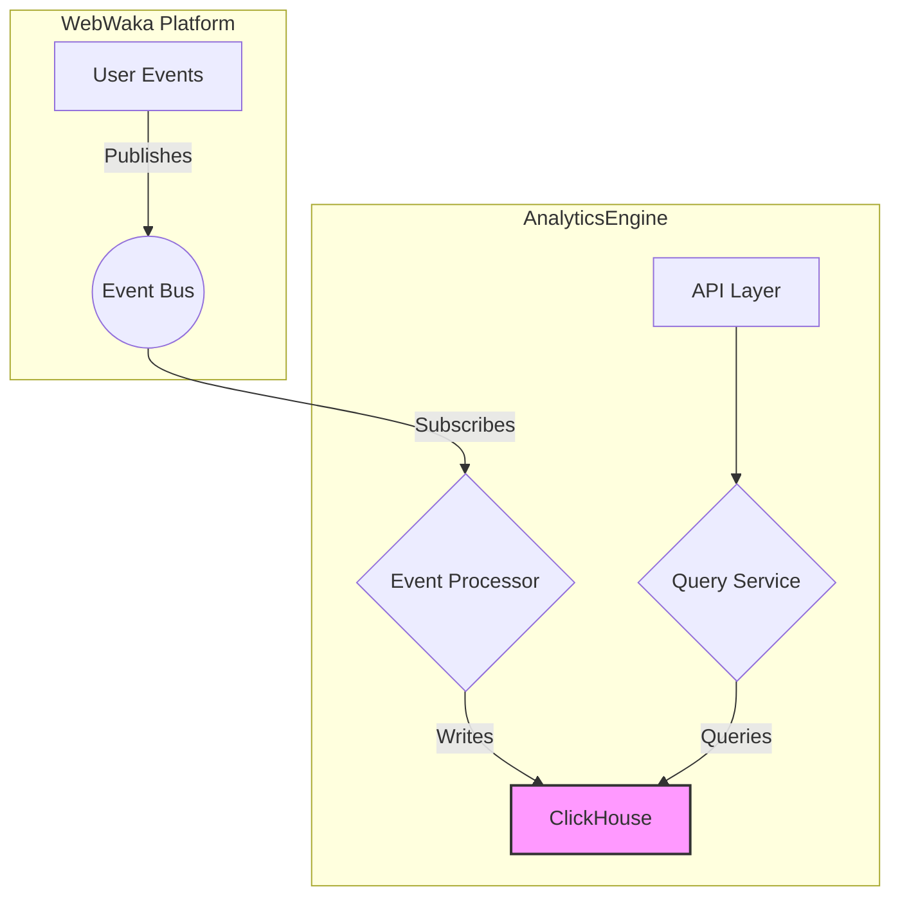

# Analytics & Reporting - Architecture

**Date:** 2026-02-12  
**Module:** Analytics & Reporting  
**Author:** webwakaagent3 (Specifications & Documentation)

---

## 1. Overview

The Analytics & Reporting module provides a comprehensive solution for tracking, analyzing, and visualizing user behavior and application performance across the WebWaka platform. It is built on a scalable, event-driven architecture with a high-performance time-series database (ClickHouse).

## 2. Core Principles

- **Scalability:** The architecture is designed to handle 10,000+ events per second.
- **Real-Time:** Analytics data is processed and available in near real-time (< 1 minute).
- **Data Accuracy:** The system ensures that all events are tracked correctly and the data is accurate.
- **Multi-Tenant:** All data is strictly isolated by tenant.

## 3. High-Level Architecture

The architecture is composed of two main services that interact with a ClickHouse database and the platform's Event Bus.



### Components

- **`Event Processor`:** This service consumes events from the Event Bus, enriches them with additional data (e.g., geolocation), and writes them to the ClickHouse database.
- **`Query Service`:** This service exposes a public API for querying analytics data from ClickHouse.
- **`ClickHouse`:** A high-performance, open-source time-series database that provides the core data storage and query functionality.
- **`Event Bus`:** The platform's event bus, used for decoupled communication between modules.

## 4. Service Breakdown

### 4.1. Event Processor

**Responsibilities:**
- Subscribing to analytics events from the Event Bus.
- Enriching events with additional data (e.g., IP geolocation, user agent parsing).
- Writing events to the ClickHouse database in batches.

### 4.2. Query Service

**Responsibilities:**
- Exposing a public API for querying analytics data.
- Enforcing tenant isolation on all queries.
- Handling query parameters (date range, limit, etc.).
- Formatting query results.

## 5. Data Model

### 5.1. Events Table

**Table Name:** `events`

```sql
CREATE TABLE events (
  timestamp DateTime,
  tenantId String,
  eventType String,
  userId String,
  sessionId String,
  page String,
  elementId Nullable(String),
  referrer Nullable(String),
  userAgent Nullable(String),
  ipAddress Nullable(String),
  metadata String
) ENGINE = MergeTree()
PARTITION BY toYYYYMM(timestamp)
ORDER BY (tenantId, timestamp);
```

## 6. Security Architecture

- **Tenant Isolation:** All queries are automatically filtered by `tenantId`.
- **Authentication:** The API will be protected by JWT-based authentication (Phase 2).
- **Data Protection:** All data is encrypted at rest and in transit.

## 7. Event Architecture

### Subscribed Events

- `analytics.pageView`
- `analytics.click`
- `analytics.formSubmission`

### Emitted Events

- `analytics.event.processed`

## 8. Future Enhancements

- **A/B Testing:** Add support for A/B testing and experimentation.
- **Machine Learning:** Integrate with machine learning models for predictive analytics.
- **Third-Party Integrations:** Add support for integrating with third-party analytics services.
