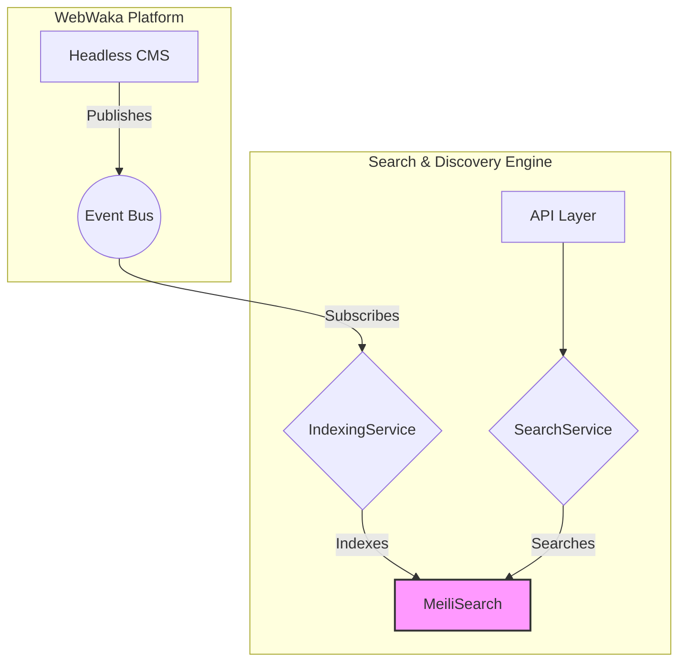

# Search & Discovery Engine - Architecture

**Date:** 2026-02-12  
**Module:** Search & Discovery Engine  
**Author:** webwakaagent3 (Specifications & Documentation)

---

## 1. Overview

The Search & Discovery Engine provides a unified, fast, and relevant search experience across all WebWaka platform content. It is built on top of **MeiliSearch** for high performance and scalability, and it integrates seamlessly with the platform's event-driven architecture.

## 2. Core Principles

- **Performance:** The architecture is designed for low-latency search queries (< 150ms).
- **Scalability:** The engine can scale to handle millions of documents and thousands of queries per second.
- **Relevance:** MeiliSearch's default ranking rules provide high-quality, relevant search results.
- **Developer Experience:** The API is simple and intuitive, making it easy to integrate with other modules.

## 3. High-Level Architecture

The architecture is composed of two main services that interact with a MeiliSearch instance and the platform's Event Bus.

### Components

- **`IndexingService`:** This service is responsible for keeping the MeiliSearch index up-to-date. It subscribes to `content.published`, `content.updated`, and `content.unpublished` events from the Event Bus and adds, updates, or removes documents from the index accordingly.
- **`SearchService`:** This service exposes a public API for querying the search index. It handles tenant isolation, pagination, filtering, and faceting.
- **`MeiliSearch`:** A high-performance, open-source search engine that provides the core indexing and search functionality.
- **`Event Bus`:** The platform's event bus, used for decoupled communication between modules.

## 4. Service Breakdown

### 4.1. IndexingService

**Responsibilities:**
- Subscribing to content events from the Event Bus.
- Transforming content events into search documents.
- Adding, updating, and deleting documents in the MeiliSearch index.
- Configuring the MeiliSearch index (searchable, filterable, sortable attributes).

### 4.2. SearchService

**Responsibilities:**
- Exposing a public search API.
- Enforcing tenant isolation on all search queries.
- Handling search parameters (query, filter, facets, pagination).
- Formatting search results.

## 5. Data Model

### 5.1. Search Index

The MeiliSearch index (`content`) stores a flattened representation of the content from the Headless CMS.

**Document Structure:**

| Field | Type | Description |
|---|---|---|
| `id` | String | Unique ID of the document |
| `tenantId` | String | The tenant the document belongs to |
| `contentType` | String | The content model name |
| `title` | String | The title of the content |
| `content` | String | The main body of the content |
| `author` | String | The author's name |
| `tags` | Array of Strings | Any tags associated with the content |
| `createdAt` | Timestamp | The creation date of the content |

### 5.2. Index Configuration

- **Searchable Attributes:** `title`, `content`, `author`, `tags`
- **Filterable Attributes:** `tenantId`, `contentType`, `createdAt`
- **Sortable Attributes:** `createdAt`, `updatedAt`

## 6. Security Architecture

- **Tenant Isolation:** All search queries are automatically filtered by `tenantId` to ensure that tenants can only access their own data.
- **Authentication:** The search API will be protected by JWT-based authentication (to be implemented in Phase 2).
- **Rate Limiting:** Rate limiting will be added to the search API to prevent abuse (to be implemented in Phase 2).

## 7. Event Architecture

### Subscribed Events

- **`content.published`:** Triggers indexing of new content.
- **`content.updated`:** Triggers re-indexing of updated content.
- **`content.unpublished`:** Triggers removal of content from the index.

### Emitted Events

- **`search.document.indexed`:** Emitted when a document is successfully indexed.
- **`search.document.removed`:** Emitted when a document is removed from the index.

## 8. Future Enhancements

- **Caching:** Add a caching layer (e.g., Redis) for frequently searched queries.
- **Advanced Search:** Support for boolean operators, phrase matching, and proximity search.
- **AI-Powered Recommendations:** Integration with an AI service to provide personalized recommendations.
