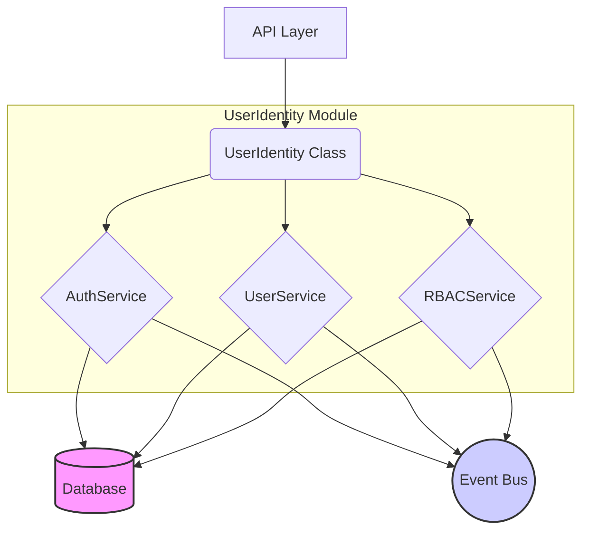
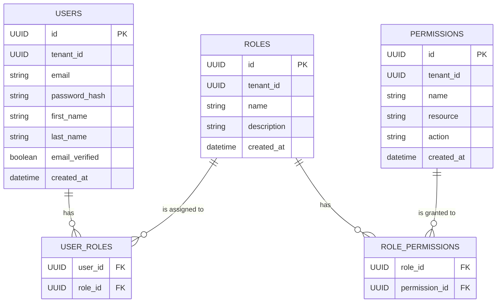

# User & Identity Management - Architecture

**Date:** 2026-02-12  
**Module:** User & Identity Management  
**Author:** webwakaagent3 (Specifications & Documentation)

---

## 1. Overview

The User & Identity Management module is a foundational service responsible for all aspects of user authentication, authorization, and identity management within the WebWaka platform. It is designed to be secure, scalable, and extensible, providing a centralized system for managing users, roles, and permissions across all tenants.

## 2. Core Principles

- **Security First:** The architecture prioritizes security at every layer, from password hashing to token management and access control.
- **Multi-Tenancy:** All data is strictly isolated by `tenantId` to ensure that tenants cannot access each other's data.
- **Event-Driven:** The module integrates with the platform's event bus, emitting events for all significant operations to enable decoupled communication between modules.
- **API-First:** All functionality is exposed through a clean, consistent RESTful API.

## 3. High-Level Architecture

The module is composed of three core services, a main class that orchestrates them, and a set of data models.

### Components

- **`UserIdentity` Class:** The main entry point for the module. It initializes the services and manages the database schema.
- **`AuthService`:** Handles all authentication-related tasks, including user registration, login, and token management.
- **`UserService`:** Manages user profiles, password changes, and password resets.
- **`RBACService`:** Manages roles, permissions, and access control checks.
- **Database:** A PostgreSQL database that stores all user, role, and permission data.
- **Event Bus:** The platform's event bus, used for emitting events to other modules.

## 4. Service Breakdown

### 4.1. AuthService

**Responsibilities:**
- User registration with email verification.
- Secure login with JWT generation.
- Password hashing using `bcrypt`.
- Password policy enforcement.
- JWT token verification.

### 4.2. UserService

**Responsibilities:**
- User profile management (CRUD operations).
- Secure password change functionality.
- Secure password reset flow with time-limited tokens.

### 4.3. RBACService

**Responsibilities:**
- Role management (CRUD operations).
- Permission management (CRUD operations).
- Assigning roles to users.
- Granting permissions to roles.
- Checking if a user has a specific permission.

## 5. Data Model

The database schema is designed to be normalized and efficient, with proper indexes for performance.

### Tables

- **`users`**: Stores user account information, including email, password hash, and profile data.
- **`roles`**: Stores role definitions.
- **`permissions`**: Stores permission definitions.
- **`user_roles`**: A join table that maps users to roles.
- **`role_permissions`**: A join table that maps roles to permissions.

### Entity-Relationship Diagram (ERD)

## 6. Security Architecture

- **Authentication:** Stateless JWT-based authentication. Tokens are signed with a secret key and have a configurable expiration time.
- **Authorization:** Role-Based Access Control (RBAC) is used to control access to resources. Permissions are granular and can be assigned to roles.
- **Password Security:** Passwords are never stored in plaintext. They are hashed using `bcrypt` with a configurable number of rounds.
- **Data Isolation:** All database queries are scoped to the `tenantId` to prevent data leakage between tenants.

## 7. Event Architecture

The module emits events for all significant operations, allowing other modules to react to changes in user identity and access control.

### Key Events

- `user.created`
- `user.login`
- `user.updated`
- `user.password.changed`
- `role.created`
- `permission.created`
- `user.role.assigned`

## 8. Future Enhancements

- **Social Login:** Integration with OAuth providers like Google and Facebook.
- **Two-Factor Authentication (2FA):** Support for TOTP-based 2FA.
- **Session Management:** A mechanism for revoking active sessions.
- **Audit Logging:** Detailed logging of all security-sensitive operations.
